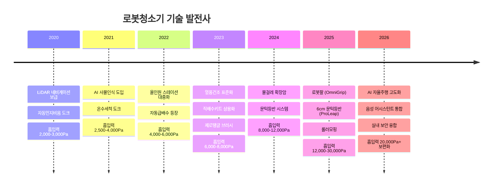

# 🤖 로봇청소기 시장조사 및 기술 분석 (2020-2026)

> 글로벌 로봇청소기 시장 동향, 주요 제조사 현황, 제품별 상세 스펙 비교 자료

[-$6.7B-blue)](https://www.statista.com)
[-20.5%25-green)](https://www.grandviewresearch.com)
[](https://www.roborock.com)

---

## 📋 목차

1. [시장 개요](#-시장-개요)
2. [주요 제조사 현황](#-주요-제조사-현황)
3. [2025-2026 플래그십 제품 비교](#-2025-2026-플래그십-제품-비교)
4. [파라미터별 상세 분석](#-파라미터별-상세-분석)
5. [기술 발전 타임라인](#-기술-발전-타임라인)
6. [한국 시장 분석](#-한국-시장-분석)
7. [참고자료](#-참고자료)

---

## 📊 시장 개요

### 글로벌 시장 규모

| 연도 | 시장 규모 | 성장률 | 비고 |
|:----:|:---------:|:------:|:-----|
| 2024 | $5.6B | - | 기준년도 |
| 2025 | $6.7B | +19.6% | 현재 |
| 2030 | $11.2B+ | CAGR 20.5% | 전망 |

### 시장 특징

- **중국 브랜드 독점**: 글로벌 판매량 TOP 5 모두 중국 기업
- **프리미엄화**: 올인원 스테이션 탑재 제품 비중 70%↑ (2025)
- **기술 경쟁 심화**: 흡입력 30,000Pa, 로봇팔, 6cm 문턱등반 등 혁신 기술 등장

---

## 🏭 주요 제조사 현황

### 글로벌 시장 점유율 (2025 Q1-Q3)

```
Roborock    ██████████████████████████████░░░░  38%
Ecovacs     ██████████████████░░░░░░░░░░░░░░░░  22%
Dreame      ████████████████░░░░░░░░░░░░░░░░░░  19%
Narwal      ████████░░░░░░░░░░░░░░░░░░░░░░░░░░   9%
Xiaomi      ██████░░░░░░░░░░░░░░░░░░░░░░░░░░░░   7%
Others      ██░░░░░░░░░░░░░░░░░░░░░░░░░░░░░░░░   5%
```

### 제조사별 상세 정보

| 순위 | 브랜드 | 국가 | 본사 위치 | 설립 | 현재 상태 | 특징 |
|:----:|:------:|:----:|:---------:|:----:|:---------:|:-----|
| 1 | **Roborock** | 🇨🇳 | 베이징 | 2014 | ✅ 운영중 | 글로벌 1위, 프리미엄 시장 선도 |
| 2 | **Ecovacs** | 🇨🇳 | 쑤저우 | 1998 | ✅ 운영중 | 전통 강자, 롤러모핑 기술 |
| 3 | **Dreame** | 🇨🇳 | 쑤저우 | 2017 | ✅ 운영중 | 기술 혁신 선도 (6cm 문턱등반) |
| 4 | **Narwal** | 🇨🇳 | 선전 | 2016 | ✅ 운영중 | 자동 물걸레 세척 최초 도입 |
| 5 | **Xiaomi** | 🇨🇳 | 베이징 | 2010 | ✅ 운영중 | 가성비 시장, 생태계 연동 |
| 6 | **Samsung** | 🇰🇷 | 수원 | 1969 | ✅ 운영중 | AI+스팀살균, SmartThings |
| 7 | **LG** | 🇰🇷 | 서울 | 1958 | ✅ 운영중 | ThinQ, 프리미엄 디자인 |
| 8 | **iRobot** | 🇺🇸 | 매사추세츠 | 1990 | ⚠️ 파산신청 | 2025.12 파산, Picea Robotics 인수 예정 |

---

## 🔬 2025-2026 플래그십 제품 비교

### 주요 스펙 요약

| 브랜드 | 모델명 | 출시 | 흡입력 | 문턱넘기 | 특징 | 가격대 |
|:------:|:------:|:----:|:------:|:--------:|:-----|:------:|
| Roborock | **Saros Z70** | 2025 | 22,000Pa | 3cm | 🦾 최초 로봇팔(OmniGrip) | 200만원+ |
| Roborock | **Saros 10R** | 2025.02 | 22,000Pa | 4cm | 📏 역대 가장 얇은 (8cm) | 160만원 |
| Roborock | **Qrevo CurvX** | 2025.05 | 18,500Pa | 4cm | 🏆 가성비 플래그십 | 130-160만원 |
| Dreame | **X50 Ultra** | 2025.01 | 20,000Pa | **6cm** | 🏔️ ProLeap 문턱등반 | 150-170만원 |
| Dreame | **Aqua10 Ultra** | 2025 | **30,000Pa** | 6cm | 💪 최대 흡입력, 롤러 물걸레 | 150만원 |
| Ecovacs | **X11 OmniCyclone** | 2025 | 19,500Pa | 2cm | ♻️ 먼지봉투 없는 사이클론 | 150만원 |
| Narwal | **Freo Z Ultra** | 2025 | 12,000Pa | 2cm | 🔄 제로탱글 브러시 | 150만원 |
| Samsung | **AI Steam Ultra** | 2025/26 | 미공개 | 6cm | 🌊 AI 액체인식, 스팀살균 | 200만원+ |
| LG | **로보킹 AI 올인원** | 2024.08 | 10,000Pa | 2cm | 🏠 ThinQ 연동, 세제자동투입 | 179-219만원 |

---

## 📐 파라미터별 상세 분석

### 스테이션 기능

| 기능 | Roborock Z70 | Dreame X50 | Ecovacs X11 | Samsung Steam | LG 로보킹 |
|:-----|:------------:|:----------:|:-----------:|:-------------:|:---------:|
| 먼지비움 | ✅ | ✅ | ✅ (사이클론) | ✅ | ✅ |
| 걸레세척 (온수) | ✅ | ✅ (75°C) | ✅ | ✅ | ❌ (냉수) |
| 걸레건조 (온풍) | ✅ | ✅ | ✅ | ✅ (스팀) | ✅ |
| 세제투입 | ❌ | ❌ | ❌ | ❌ | ✅ |
| 직배수 | ❌ | ❌ | ❌ | ❌ | 옵션 |
| 100°C 스팀살균 | ❌ | ❌ | ❌ | ✅ | ❌ |
| 자동급수 | ✅ | ✅ | ✅ | ✅ | 옵션 |

### 흡입력 (Pa) 등급별 분류

```
30,000Pa+   ████████████████████████████████████  Dreame Aqua10 Ultra
25,001~     ██████████████████████████████░░░░░░  -
~25,000     ████████████████████████░░░░░░░░░░░░  -
~20,000     ██████████████████████░░░░░░░░░░░░░░  Roborock Z70/10R, Dreame X50
~15,000     ██████████████░░░░░░░░░░░░░░░░░░░░░░  Narwal Flow
~10,000     ██████████░░░░░░░░░░░░░░░░░░░░░░░░░░  Samsung, LG
~6,000      ██████░░░░░░░░░░░░░░░░░░░░░░░░░░░░░░  Xiaomi X20+
```

### 센서 및 감지 기능

| 기능 | 설명 | 지원 제품 |
|:-----|:-----|:----------|
| **AI 사물인식** | 딥러닝 기반 100종+ 사물 인식 | Roborock, Dreame, Ecovacs, Samsung |
| **AI 바닥인식** | 바닥재질 자동 감지 | Dreame X50, Samsung |
| **AI 액체인식** | 물/음료 등 액체 회피 | Samsung AI Steam Ultra |
| **문턱등반** | 높은 문턱 자동 등반 | Dreame (6cm), Roborock (4cm) |
| **카펫회피** | 물걸레 시 카펫 자동 회피 | 대부분 지원 |
| **오염도감지** | 더러운 구역 재청소 | Dreame, Samsung |

### 물걸레 타입별 특징

| 타입 | 원리 | 장점 | 단점 | 대표 제품 |
|:-----|:-----|:-----|:-----|:----------|
| **회전형** | 원형 패드 회전 | 높은 압력, 효율적 | 모서리 청소 약함 | Roborock, Dreame |
| **롤러형** | 롤러 회전+실시간 세척 | 자체 세척, 위생적 | 복잡한 구조 | Ecovacs X11, Narwal Flow |
| **음파진동형** | 고주파 진동 | 얼룩 제거 우수 | 낮은 압력 | 일부 중저가 모델 |

### 브러쉬 구성

| 구성 | 특징 | 대표 제품 |
|:-----|:-----|:----------|
| **DuoDivide (분리형)** | 고무+브러시 분리, 엉킴 방지 | Roborock Saros |
| **DuoBrush (듀얼)** | 메인 브러쉬 2개 | Dreame X50/L50 |
| **제로탱글** | 머리카락 엉킴 완전 방지 | Narwal Freo Z |
| **사이드 확장암** | 모서리 청소 확장 | Dreame, Ecovacs |

---

## 📈 기술 발전 타임라인

### 2020-2026 주요 혁신



### 흡입력 발전 추이

| 연도 | 최대 흡입력 | 대표 제품 | 기술 혁신 |
|:----:|:----------:|:----------|:----------|
| 2020 | 3,000Pa | Roborock S6 MaxV | LiDAR + AI 카메라 |
| 2021 | 4,000Pa | Roborock S7 | 음파진동 물걸레 |
| 2022 | 6,000Pa | Roborock S7 MaxV Ultra | 올인원 도크 |
| 2023 | 8,000Pa | Dreame X30 Ultra | 열풍건조 |
| 2024 | 12,000Pa | Dreame X40 Ultra | Flex Arm |
| 2025 | **30,000Pa** | Dreame Aqua10 Ultra | 롤러 물걸레 |

---

## 🇰🇷 한국 시장 분석

### 시장 점유율 (2024-2025)

```
                    2024        2025 상반기    프리미엄(130만원↑)
Roborock    ████████████████    ██████████████████    ████████████████████████████
             46%                 50%+                  55-72%

Samsung     ████████████        ████████████          ██████████
             22%                 ~22%                  10-18%

Dreame      ██████████          ████████████          ████████
             ~10%                ~12%                  ~12%

LG          ██████              ██████                ████
             9%                  7-9%                  ~7%

Ecovacs     ████                ████                  ██
             4%                  ~4%                   기타
```

### 한국 시장 특징

1. **로보락 독주**: 프리미엄 시장 55-72% 점유
2. **드리미 급성장**: 2024년 10% → 2025년 12%+ 
3. **에코백스 급락**: 2023년 13.5% → 2025년 4%
4. **삼성 중저가 전략**: 가성비 라인업 강화로 점유율 유지
5. **LG 하락세**: 점유율 지속 감소, 프리미엄 전략 재정비 필요

---

## 📁 파일 구조

```
robot-vacuum-market-research/
├── README.md                          # 이 문서
├── data/
│   ├── products_2020-2026.xlsx        # 제품 상세 스펙 데이터
│   ├── market_share.xlsx              # 시장 점유율 데이터
│   └── parameter_comparison.xlsx      # 파라미터별 비교표
├── docs/
│   ├── navigation_technology.md       # SLAM/내비게이션 기술 분석
│   ├── 3d_tof_navigation.md           # 3D ToF 센서 기술 분석
│   └── ir_docking_system.md           # IR 도킹 시스템 분석
└── images/
    ├── market_share_chart.png
    └── technology_timeline.png
```

---

## 📚 참고자료

### 시장 보고서
- [Grand View Research - Robot Vacuum Cleaner Market](https://www.grandviewresearch.com/industry-analysis/robot-vacuum-cleaner-market)
- [Statista - Robotic Vacuum Cleaners Market](https://www.statista.com/outlook/cmo/household-appliances/vacuum-cleaners/robotic-vacuum-cleaners/worldwide)

### 제조사 공식 사이트
- [Roborock](https://www.roborock.com)
- [Dreame](https://www.dreametech.com)
- [Ecovacs](https://www.ecovacs.com)
- [Narwal](https://www.narwal.com)
- [Samsung](https://www.samsung.com/sec/vacuum-cleaners/)
- [LG](https://www.lge.co.kr/robot-vacuum)

### 기술 문서
- [Slamtec SLAM Solutions](https://www.slamtec.com)
- [Camsense LiDAR](https://www.camsense.cn)
- [Infineon 3D ToF Sensors](https://www.infineon.com/cms/en/product/sensor/tof-3d-image-sensors/)

---

## 📝 라이선스

이 문서는 시장조사 및 기술 분석 목적으로 작성되었습니다.  
데이터 출처를 명시하여 자유롭게 활용 가능합니다.

---

## 🔄 업데이트 이력

| 날짜 | 버전 | 내용 |
|:----:|:----:|:-----|
| 2026-01-07 | v1.0 | 초기 문서 작성 |

---

<div align="center">

**Made with 💡 for Robot Vacuum Research**

</div>
