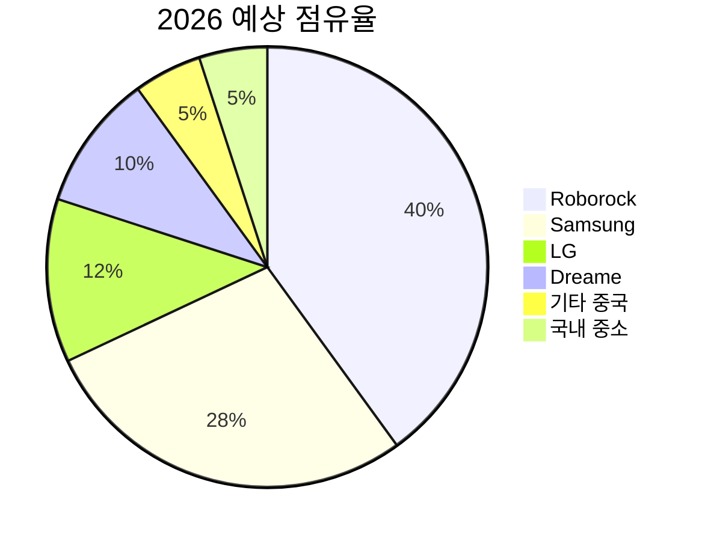

# 🇰🇷 국내 로봇청소기 업체 총람 (2024-2026)

> 국내 로봇청소기 제조/판매 업체 현황, TOP 10 업체 규모 분석, 시장 동향

[-1조원+-blue)](https://www.gfk.com)
[](https://www.samsung.com)
[](https://www.etnews.com)

---

## 📋 목차

1. [국내 시장 개요](#-국내-시장-개요)
2. [국내 로봇청소기 업체 총람](#-국내-로봇청소기-업체-총람)
3. [TOP 10 업체 규모 분석](#-top-10-업체-규모-분석)
4. [업체별 상세 정보](#-업체별-상세-정보)
5. [시장 동향 및 전망](#-시장-동향-및-전망)
6. [참고자료](#-참고자료)

---

## 📊 국내 시장 개요

### 시장 규모 추이

| 연도 | 시장 규모 | 성장률 | 비고 |
|:----:|:---------:|:------:|:-----|
| 2022 | 2,900억원 | - | 기준년도 |
| 2023 | 3,712억원 | +28% | 프리미엄 제품 중심 성장 |
| 2024 | 6,700억원 | +80% | 올인원 제품 대중화 |
| 2025 | **1조원+** | +49% | 삼성/LG 2세대 출시 |

### 국내 시장 점유율 (2024-2025)

```
              매출 기준 점유율 (2024)
              
Roborock (중국)  ████████████████████████████████████████  46%
Samsung (한국)   ██████████████████░░░░░░░░░░░░░░░░░░░░░░  22%
Dreame (중국)    ████████████░░░░░░░░░░░░░░░░░░░░░░░░░░░░  12%
LG (한국)        ████████░░░░░░░░░░░░░░░░░░░░░░░░░░░░░░░░   9%
Ecovacs (중국)   ████░░░░░░░░░░░░░░░░░░░░░░░░░░░░░░░░░░░░   4%
기타             ████████░░░░░░░░░░░░░░░░░░░░░░░░░░░░░░░░   7%
```

### 국내 vs 중국 업체 점유율

| 구분 | 2023 | 2024 | 2025 (예상) | 추세 |
|:----:|:----:|:----:|:-----------:|:----:|
| **중국 업체** | 70% | 62% | 55% | 📉 |
| **국내 업체** | 30% | 38% | 45% | 📈 |

> ⚠️ **주목**: 삼성/LG의 2세대 제품 출시와 보안 이슈로 국내 업체 점유율 상승 중

---

## 🏭 국내 로봇청소기 업체 총람

### 대기업 (2개사)

| 업체명 | 브랜드 | 주요 제품 | 시장 포지션 |
|:------:|:------:|:----------|:------------|
| **삼성전자** | 비스포크 AI | Jet Bot, AI Steam | 프리미엄, 2위 |
| **LG전자** | 로보킹 | AI 올인원, 코드제로 | 프리미엄, 3위 |

### 중견기업 (3개사)

| 업체명 | 브랜드 | 주요 제품 | 시장 포지션 |
|:------:|:------:|:----------|:------------|
| **쿠쿠홈시스** | 파워클론 | 로봇청소기 AI, AI 2 | 가성비, 신규진입 |
| **유진로봇** | 아이클레보 | 오메가, G5 | 중저가, 전통 강자 |
| **에브리봇** | 에브리봇 | Q11, 엣지 | 물걸레 전문, 상장사 |

### 중소기업 (7개사+)

| 업체명 | 브랜드 | 주요 제품 | 특징 |
|:------:|:------:|:----------|:-----|
| **나린R&D** | 라이스타 | L-시리즈 | LiDAR 탑재 모델 |
| **파인로보틱스** | 아이센스 | iSensor | 산업용 전환 중 |
| **에코트윈** | 에코트윈 | 올인원 | ODM 위주 |
| **코맥스** | 코맥스 | - | 홈IoT 연계 |
| **위닉스** | 위닉스 | - | 공기청정기 연계 |
| **한경희생활과학** | 스팀큐 | 물걸레 | 스팀 청소 특화 |
| **아이앤컴퍼니** | 봇클 | AI 로봇 | 스타트업 |

### ODM/OEM 전문 (국내 생산)

| 업체명 | 주요 고객사 | 특징 |
|:------:|:------------|:-----|
| **필립스 ODM** (유진로봇) | 필립스 | 유럽 수출용 |
| **샤오미 ODM** (일부) | 샤오미 | 부품 공급 |

---

## 📈 TOP 10 업체 규모 분석

### 업체별 규모 비교 (2024 기준)

| 순위 | 업체명 | 전체 매출 | 로봇청소기 매출(추정) | 직원수 | 비고 |
|:----:|:------:|:---------:|:--------------------:|:------:|:-----|
| 1 | **삼성전자** | 300조원+ | 1,500억원+ | 267,000+ | 대기업 |
| 2 | **LG전자** | 87.7조원 | 600억원+ | 75,000+ | 대기업 |
| 3 | **쿠쿠홈시스** | 1.2조원 | 100억원+ | 3,500+ | 중견기업 |
| 4 | **유진로봇** | 300억원+ | 100억원+ | 250+ | 중견기업 |
| 5 | **에브리봇** | 317억원 | 250억원+ | 100+ | 코스닥 상장 |
| 6 | **아이클레보** | 100억원+ | 100억원+ | 50+ | 유진로봇 분사 |
| 7 | **나린R&D** | 50억원+ | 40억원+ | 30+ | 중소기업 |
| 8 | **파인로보틱스** | 30억원+ | 10억원+ | 20+ | 중소기업 |
| 9 | **에코트윈** | 30억원+ | 25억원+ | 20+ | 중소기업 |
| 10 | **아이앤컴퍼니** | 10억원+ | 10억원+ | 10+ | 스타트업 |

> ※ 로봇청소기 매출은 공개 자료 기반 추정치, 실제와 다를 수 있음

### 재무 현황 상세 (상장사 기준)

#### 삼성전자 (005930)
```
매출액 (2024): 300조원+
영업이익: 32조원+
생활가전 부문: 약 15조원 (로봇청소기 포함)
R&D 투자: 연 35조원+
로봇청소기 점유율: 22% (2위)
```

#### LG전자 (066570)
```
매출액 (2024): 87.7조원
영업이익: 3.4조원
H&A(생활가전) 부문: 30조원+
R&D 투자: 연 5조원+
로봇청소기 점유율: 9% (3위)
```

#### 에브리봇 (270660)
```
매출액 (2024): 317억원 (전년 대비 -40%)
영업이익: 15억원 (전년 대비 -75%)
시가총액: 약 800억원
상장: 코스닥
주요 제품: 물걸레 로봇청소기
```

#### 쿠쿠홈시스 (284740)
```
매출액 (2024 상반기): 전년 대비 +11.7%
영업이익: 전년 대비 +26.3%
청소기 판매 성장률: +36% (2025)
시가총액: 약 8,000억원
로봇청소기: 2024년 12월 첫 출시
```

---

## 🔍 업체별 상세 정보

### 1️⃣ 삼성전자

| 항목 | 내용 |
|:-----|:-----|
| **설립** | 1969년 |
| **본사** | 경기도 수원시 |
| **로봇청소기 브랜드** | 비스포크 AI 스팀 |
| **첫 올인원 출시** | 2024년 4월 |
| **2025 신제품** | 비스포크 AI 스팀 2세대 |
| **주요 기술** | 100°C 스팀살균, Knox 보안, AI 액체인식, 6cm 문턱등반 |
| **강점** | 전국 AS망, 브랜드 신뢰도, SmartThings 연동 |
| **약점** | 후발주자, 흡입력 미공개 |
| **목표** | 2025년 국내 1위 탈환 |

**주요 제품 라인업**:
- 비스포크 AI 스팀 Ultra (프리미엄) - 200만원대
- 비스포크 AI 스팀 (중급) - 150만원대
- 비스포크 스팀 (보급형) - 100만원대

---

### 2️⃣ LG전자

| 항목 | 내용 |
|:-----|:-----|
| **설립** | 1958년 |
| **본사** | 서울시 영등포구 |
| **로봇청소기 브랜드** | 로보킹, 코드제로 |
| **첫 올인원 출시** | 2024년 8월 |
| **2025 신제품** | 히든 스테이션, 오브제 스테이션 |
| **주요 기술** | 본체+스테이션 스팀, LG 쉴드 보안, AI 사물인식 |
| **강점** | 디자인, 가전 생태계, ThinQ 연동 |
| **약점** | 늦은 시장 진입, 흡입력 경쟁력 |
| **전략** | 빌트인형으로 차별화 |

**주요 제품 라인업**:
- 로보킹 AI 올인원 (프리미엄) - 179-219만원
- 코드제로 R9 (흡입 전용)
- 코드제로 M9 (물걸레 전용)

---

### 3️⃣ 쿠쿠홈시스

| 항목 | 내용 |
|:-----|:-----|
| **설립** | 1978년 (전자압력밥솥) |
| **본사** | 경기도 양주시 |
| **로봇청소기 브랜드** | 파워클론 |
| **첫 로봇청소기** | 2024년 12월 |
| **주요 기술** | AI 카메라, dToF, LiDAR, 16,200Pa 흡입력 |
| **강점** | 렌탈 사업 기반, 전국 AS망, 가성비 |
| **약점** | 로봇청소기 신규 진입, 브랜드 인지도 |
| **성과** | 청소기 전체 판매 +36% (2025) |

**주요 제품**:
- 파워클론 로봇청소기 AI 2 (2025.06)
- 파워클론 로봇청소기 AI (2024.12)

---

### 4️⃣ 유진로봇 / 아이클레보

| 항목 | 내용 |
|:-----|:-----|
| **설립** | 1988년 |
| **본사** | 대전시 유성구 |
| **브랜드** | 아이클레보 |
| **분사** | 2023년 아이클레보(주) 독립 |
| **역사** | 2002년 국내 최초 로봇청소기 |
| **주요 기술** | 카메라 SLAM, 엉킴방지 블레이드 |
| **강점** | 기술력, 30개국 수출, 가성비 |
| **약점** | 중소기업 AS 한계, 브랜드 인지도 |
| **수상** | 2011 세계 일류상품, 2021 올해의 로봇기업 |

**주요 제품**:
- 아이클레보 오메가 (플래그십)
- 아이클레보 G5 Max
- 아이클레보 라이언 (컴팩트)

---

### 5️⃣ 에브리봇

| 항목 | 내용 |
|:-----|:-----|
| **설립** | 2015년 |
| **본사** | 경기도 과천시 |
| **상장** | 코스닥 (270660) |
| **특화** | 물걸레 로봇청소기 |
| **차별화** | 세계 최초 듀얼스핀 물걸레 (2016) |
| **확장** | 서빙로봇, AI 자율주행 플랫폼 |
| **강점** | 물걸레 기술력, 상장사 신뢰도 |
| **약점** | 매출 감소 추세, 흡입력 경쟁 |

**주요 제품**:
- 에브리봇 Q11 (AI 올인원, 20,000Pa)
- 에브리봇 엣지 (물걸레 전용)
- 에브리봇 쓰리스핀

---

### 6️⃣ 나린R&D (라이스타)

| 항목 | 내용 |
|:-----|:-----|
| **설립** | 2010년대 |
| **본사** | 경기도 |
| **브랜드** | 단후이 → 라이프로 → 라이스타 |
| **포지션** | 가성비 중저가 |
| **특징** | LiDAR 탑재 모델, 40-50만원대 |
| **수상** | 2017 한국소비자만족지수 1위 |
| **강점** | 가성비, 꼼꼼한 청소 |
| **약점** | 브랜드 인지도, AS 인프라 |

---

## 📉 시장 동향 및 전망

### 2024-2025 주요 동향

#### 1. 삼성/LG의 본격 반격
- 2024년 첫 올인원 제품 출시로 시장 진입
- 2025년 2세대 제품으로 기술 격차 축소
- **삼성**: 국내 점유율 1위 목표 선언
- **LG**: 빌트인형/스팀 차별화 전략

#### 2. 보안 이슈의 부각
- 2025년 9월 한국소비자원/KISA 합동 조사
- 중국산 3개 제품(드리미, 에코백스, 나르왈) 보안 취약점 발견
- 삼성 Knox, LG 쉴드 등 국내 보안 솔루션 강조

#### 3. 중소기업의 시장 진입
- **쿠쿠**: 2024년 12월 로봇청소기 시장 진입
- 렌탈 사업 연계로 차별화
- 청소기 전체 판매량 36% 성장

#### 4. 기술 경쟁 심화
| 기술 | 중국 업체 | 국내 업체 |
|:-----|:----------|:----------|
| 흡입력 | 30,000Pa (Dreame) | 미공개 (삼성) |
| 문턱등반 | 6cm (Dreame ProLeap) | 6cm (삼성 2세대) |
| 로봇팔 | O (Roborock Z70) | X |
| 스팀살균 | X | O (삼성, LG) |
| 보안 | 취약점 발견 | Knox, 쉴드 |

### 2026 전망



#### 예상 시나리오

**낙관적 시나리오** (국내 업체 45%+):
- 삼성/LG 2세대 제품 흥행
- 보안 이슈로 중국산 기피 현상 확대
- 국내 중소기업 가성비 시장 공략 성공

**보수적 시나리오** (국내 업체 35%):
- 중국 업체의 보안 강화 대응
- 기술 격차 지속
- 가격 경쟁력 열세

### 국내 업체 전략 분석

#### 대기업 전략
| 업체 | 핵심 전략 | 차별화 포인트 |
|:----:|:----------|:--------------|
| 삼성 | AI + 보안 | Knox 보안, 액체 인식, SmartThings |
| LG | 디자인 + 위생 | 빌트인형, 본체+스테이션 스팀 |

#### 중소기업 생존 전략
1. **틈새시장 공략**: 물걸레 전용(에브리봇), 가성비(아이클레보)
2. **렌탈 연계**: 쿠쿠의 렌탈 사업 모델
3. **ODM/OEM**: 해외 브랜드 생산 대행
4. **B2B 전환**: 상업용/산업용 로봇 (유진로봇)

---

## 📚 참고자료

### 기업 공시
- [삼성전자 IR](https://www.samsung.com/sec/ir/)
- [LG전자 뉴스룸](https://live.lge.co.kr)
- [에브리봇 IR](https://comp.fnguide.com/SVO2/ASP/SVD_Main.asp?gicode=A270660)
- [쿠쿠홈시스 IR](https://comp.fnguide.com/SVO2/ASP/SVD_Main.asp?gicode=A284740)

### 시장 조사 기관
- [GfK Korea](https://www.gfk.com/ko)
- [IDC Korea](https://www.idc.com)

### 뉴스 기사
- [로봇신문](https://www.irobotnews.com)
- [전자신문](https://www.etnews.com)
- [디지털데일리](https://www.ddaily.co.kr)

---

## 📝 업데이트 이력

| 날짜 | 버전 | 내용 |
|:----:|:----:|:-----|
| 2026-01-07 | v1.0 | 초기 문서 작성 |

---

<div align="center">

**국내 로봇청소기 산업의 도약을 기대합니다** 🚀

</div>
