# 🤖 로봇 청소기 IR 네비게이션 시스템 분석

로봇 청소기의 적외선(IR) 기반 네비게이션 시스템을 분석한 문서입니다. 충전 스테이션 도킹 유도와 장애물 회피 기능의 원리와 구현 방법을 다룹니다.

## 📋 목차

- [1. 시스템 개요](#1-시스템-개요)
- [2. 주요 부품 목록](#2-주요-부품-목록)
- [3. 도킹 알고리즘](#3-도킹-알고리즘)
- [4. 장애물 회피 시스템](#4-장애물-회피-시스템)
- [5. 참고 자료](#5-참고-자료)

---

## 1. 시스템 개요

### 1.1 충전 스테이션 (Docking Station)

<!-- 실제 사진을 여기에 추가하세요 -->


### 1.2 로봇 본체 (Robot Body)

<!-- 실제 사진을 여기에 추가하세요 -->


### 1.3 기능별 역할 분석

#### 🔴 충전 스테이션 IR LED (송신)

| 위치 | 구성 | 기능 |
|------|------|------|
| **상단 Blue LED** | 좌우 대칭 4개, 곡면 렌즈 | 상태 표시 (충전중/대기) |
| **상단 평면 IR LED** | 좌우 끝, 평평한 면 | 근접 회피 신호 (Omni-directional Force Field) |
| **하단 IR LED** | SMD 타입 5개 | 도킹 유도 빔 (방향성 코딩된 신호) |

**하단 IR LED 상세 구성:**
- **Far L/R** (±30° 방향): Force Field - 청소 중 스테이션 회피용
- **Front L/R** (정면 좌우): 좌우 정렬 빔 - Overlapping Field 형성
- **Center** (정중앙): 정밀 도킹 빔 - Home Beam

> **참고**: 먼지통이 후면에 위치하며, 로봇은 **정면으로 도킹**합니다. 
> 자동 비움 스테이션의 경우 도킹 후 후면 먼지통이 흡입구와 연결됩니다.

#### 🔵 로봇 본체 IR 센서

| 위치 | 구성 | 기능 |
|------|------|------|
| **범퍼 IR TX** | SMD LED × 20개 | 장애물 감지용 (반사 방식, 38kHz 변조) |
| **전면 IR RX ×2** | 정면 중앙, 근접 배치 | 도킹 빔 수신 (정밀 정렬) |
| **전면 ±120° IR RX** | 좌우 대칭 | 광역 도킹 신호 탐지 |
| **후면 ±120° IR RX** | 뒷면 좌우 각 1개 | Virtual Wall 감지 / 후진 시 충돌 방지 |

---

## 2. 주요 부품 목록

### 2.1 충전 스테이션 BOM

| Ref | Part Number | Description | Qty |
|-----|-------------|-------------|-----|
| U1 | 7805 | 5V LDO Regulator | 1 |
| U3 | S033 PHVG 825Y | IR Controller/Timer IC | 1 |
| Q1-Q15 | HY3D | N-ch MOSFET (IR LED Driver) | 15 |
| D1 | SS24 | 2A Schottky Diode | 1 |
| D2 | MCC ME | Rectifier Diode | 1 |
| C1 | 100µF 35V | Electrolytic Capacitor | 1 |
| LED1-5 | - | Status Indicator (Blue/Green) | 5 |
| IR LED | 940nm SMD | Docking Beacon Emitter | 5 |
| TP1-13 | - | Test Points | 13 |

### 2.2 로봇 본체 BOM

| Ref | Part Number | Description | Qty |
|-----|-------------|-------------|-----|
| MCU | STM32F103C8T6 | Main Controller (ARM Cortex-M3) | 1 |
| IR TX | 940nm SMD LED | Obstacle Detection Emitter | 20 |
| Omni-RX | Dome Type IR Receiver | Docking Signal Receiver | 1 |
| Dir-RX | TSOP38238 / VS1838B | Directional IR Receiver | 6 |
| Obst-RX | TSOP38238 | Obstacle Detection Receiver | N |
| Driver | 74HC595 / ULN2803 | LED Array Driver | 3 |
| OSC | NE555 (Optional) | 38kHz Oscillator | 1 |
| Motor Driver | L298N | Dual H-Bridge | 1 |

### 2.3 공통 사양

| Parameter | Value | Note |
|-----------|-------|------|
| IR 캐리어 주파수 | 38kHz ±1kHz | TSOP38238 최적 감도 |
| IR 파장 | 940nm | 근적외선 |
| 장애물 감지 범위 | 2cm ~ 40cm | 가변저항으로 조절 |
| 빔 필드 각도 | 45° ~ 90° | Front L/R Overlap |

---

## 3. 도킹 알고리즘

### 3.1 도킹 시나리오 개요

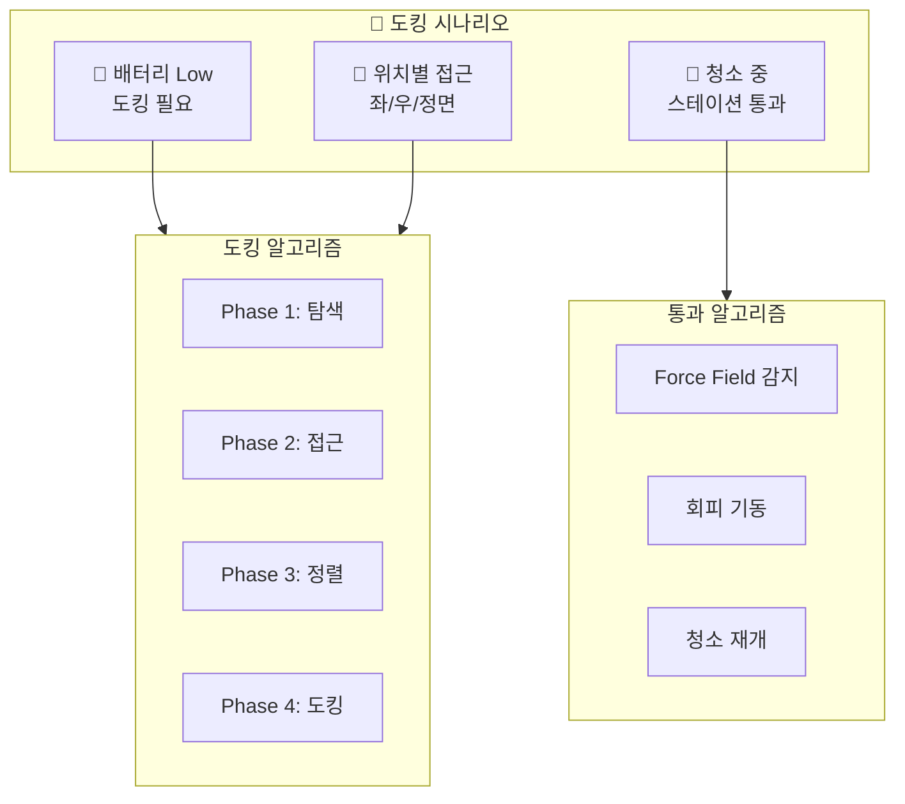

### 3.2 배터리 Low → 도킹 복귀 (메인 알고리즘)

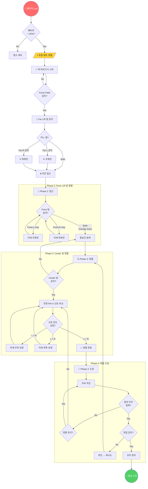

### 3.3 청소 중 스테이션 통과 시나리오

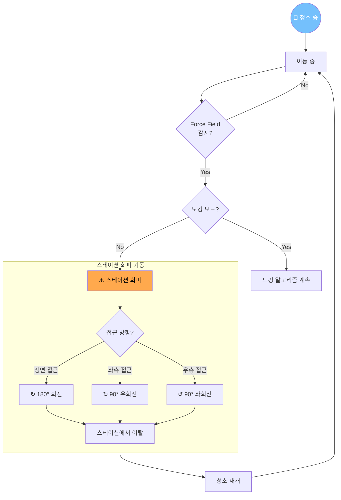

### 3.4 위치별 도킹 접근 시나리오

#### Case 1: 스테이션 왼쪽에서 접근

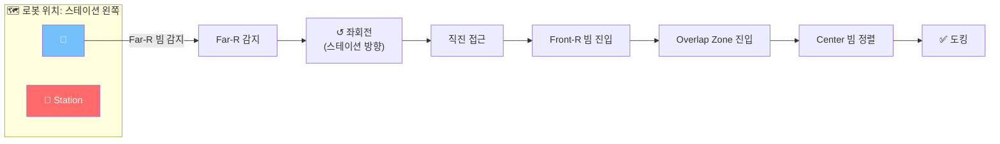

#### Case 2: 스테이션 오른쪽에서 접근

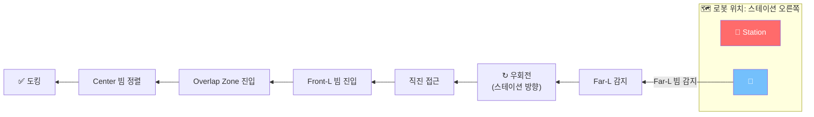

#### Case 3: 스테이션 정면에서 접근 (좌측으로 틀어짐)


#### Case 4: 스테이션 정면에서 접근 (우측으로 틀어짐)

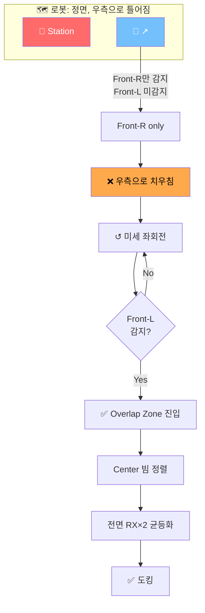

#### Case 5: 후면이 스테이션을 향할 때 (180° 회전 후 정면 도킹)

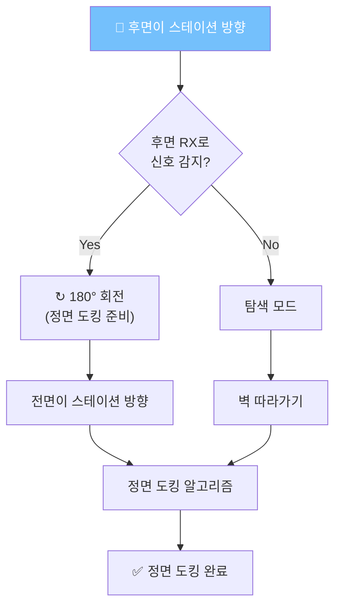

> **Note**: 이 로봇은 **정면 도킹만 지원**합니다. 후면에 먼지통이 있어 역방향 도킹은 불가능하며, 
> 후면 IR RX는 Virtual Wall 감지 및 후진 시 충돌 방지 용도로 사용됩니다.

### 3.5 도킹 빔 필드 다이어그램

> **도킹 방식**: 정면 도킹 (Front-First Docking)
> - 로봇 전면의 충전 단자가 스테이션과 접촉
> - 먼지통(후면)은 자동 비움 스테이션의 흡입구와 연결

```
                    ┌─────────────┐
                    │   Station   │
                    └──────┬──────┘
                           │
            Far-L    Front-L│Front-R    Far-R
              ╲        ╲    │    ╱        ╱
               ╲        ╲   │   ╱        ╱
                ╲    ────┼───────    ╱
                 ╲  ╱    │Center╲  ╱
                  ╲╱     │       ╲╱
                   ╲     │       ╱
                    ╲    │      ╱
                     ╲   │     ╱
              Force   ╲  │    ╱   Force
              Field    ╲ │   ╱    Field
               (회피)   ╲│  ╱     (회피)
                        ╲│ ╱
                    ┌────┴────┐
                    │ Overlap │ ← 정렬 구간
                    │  Zone   │
                    └─────────┘
                         │
                         ▼
                    [도킹 경로]
```

---

## 4. 장애물 회피 시스템

### 4.1 IR 센서 사양

#### 송신부 (TX LED)

| Parameter | Value |
|-----------|-------|
| 파장 | 940nm (근적외선) |
| 구동 주파수 | 38kHz PWM 변조 |
| 구동 전류 | 20~100mA (거리에 따라 조절) |
| 빔 각도 | 20°~30° (SMD 타입) |
| 배치 | 범퍼 전면 20개 (순차 스캔) |

#### 수신부 (IR Receiver)

| Parameter | Value |
|-----------|-------|
| 호환 IC | TSOP38238 / VS1838B |
| 수신 파장 | 940nm ±50nm |
| 중심 주파수 | 38kHz |
| 특징 | AGC (Auto Gain Control) 내장 |
| 출력 방식 | Active Low (감지 시 LOW) |

#### 감지 원리

```
    ┌─────────┐
    │ IR TX   │ ────── 38kHz 변조 신호 ──────▶ ┌──────────┐
    │  LED    │                                │  장애물   │
    └─────────┘                                │          │
                                               └────┬─────┘
    ┌─────────┐                                     │
    │ IR RX   │ ◀────── 반사 신호 ──────────────────┘
    │ Sensor  │
    └─────────┘
    
    감지 거리 = f(반사 신호 강도)
    유효 범위: 2cm ~ 40cm
```

### 4.2 장애물 회피 메인 알고리즘

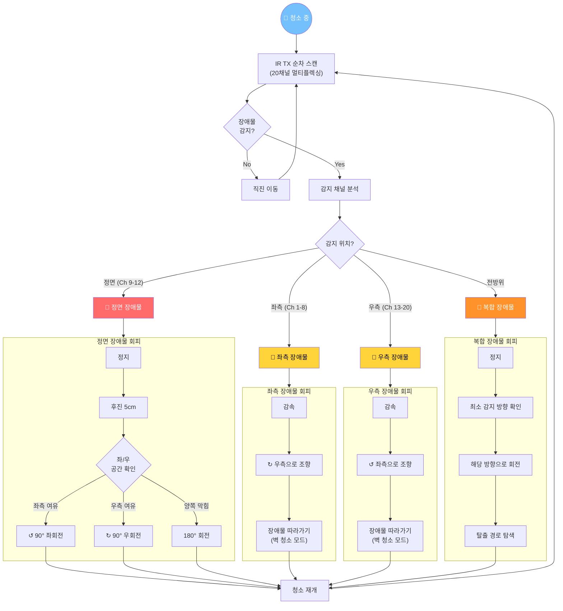

### 4.3 시나리오별 장애물 회피

#### Scenario 1: 정면 벽 감지

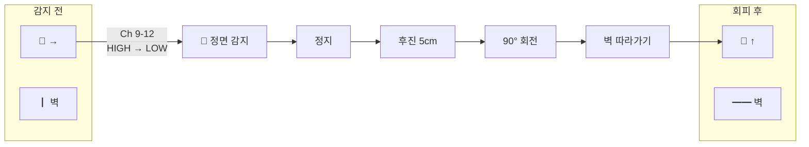

#### Scenario 2: 좌측 장애물 (가구 다리 등)

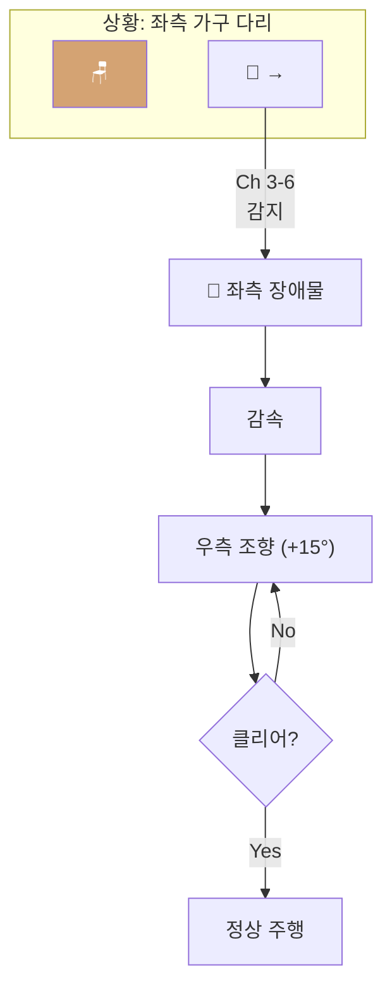

#### Scenario 3: 우측 장애물

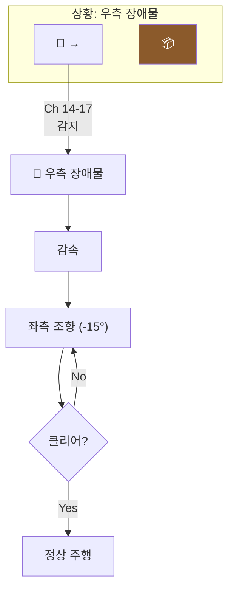

#### Scenario 4: 코너 진입 (양측 장애물)

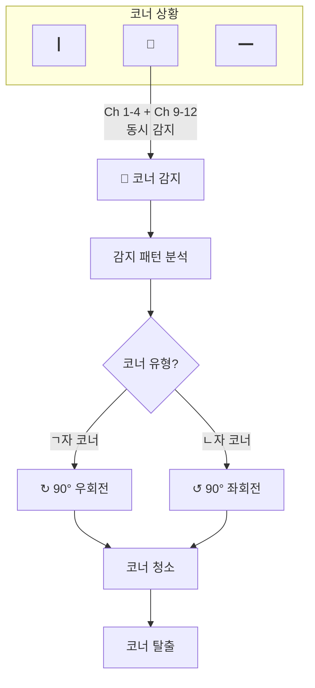

#### Scenario 5: 낭떠러지 감지 (계단 등)

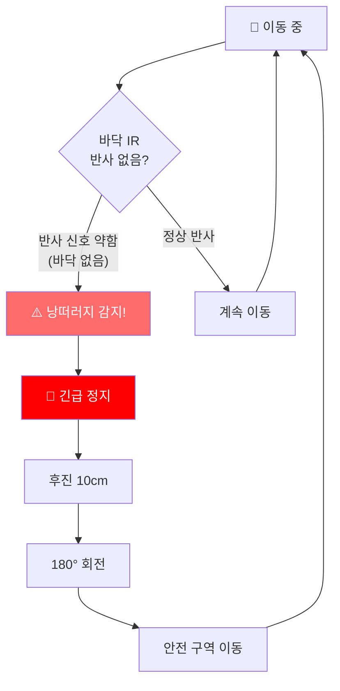

#### Scenario 6: 이동 중인 장애물 (사람, 반려동물)

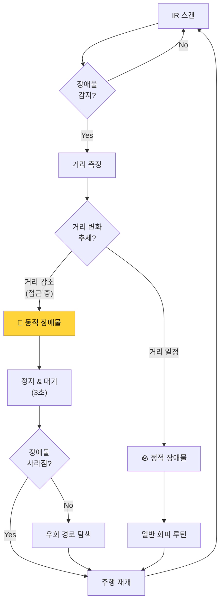

### 4.4 센서 채널 맵핑

```
              전면
        ┌─────────────────┐
        │  9  10  11  12  │  ← 정면 감지
       ╱│ 8            13 │╲
      ╱ │ 7            14 │ ╲
     │  │ 6            15 │  │
     │  │ 5            16 │  │
      ╲ │ 4            17 │ ╱
       ╲│ 3            18 │╱
        │ 2            19 │
        │ 1            20 │
        └─────────────────┘
              후면
              
    Ch 1-8:   좌측 감지
    Ch 9-12:  정면 감지  
    Ch 13-20: 우측 감지
```

---

## 5. 참고 자료

### 특허 문서

| Patent No. | Title | Owner |
|------------|-------|-------|
| US8380350B2 | Autonomous coverage robot navigation system | iRobot |
| US20120323365A1 | Docking process for recharging an autonomous mobile device | Microsoft |
| US8311674B2 | Robotic vacuum cleaner | Samsung |
| US20140100693A1 | Robot management systems for determining docking station pose | iRobot |

### 기술 문서

- [TSOP38238 Datasheet](https://www.vishay.com/docs/82459/tsop382.pdf)
- [iRobot Virtual Wall Lighthouse Overview](https://homesupport.irobot.com/)
- [IR Obstacle Avoidance Sensor Module](https://protosupplies.com/product/ir-obstacle-avoidance-sensor-module/)

---

## 📄 라이선스

이 문서는 교육 및 연구 목적으로 작성되었습니다.

---

*Last Updated: 2025.01*
