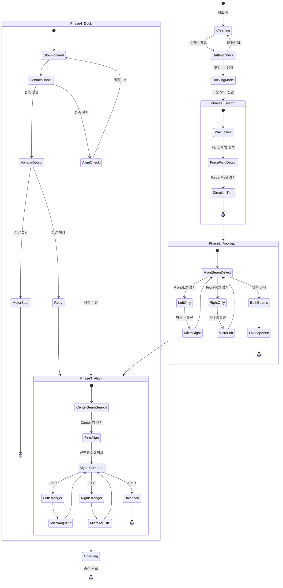
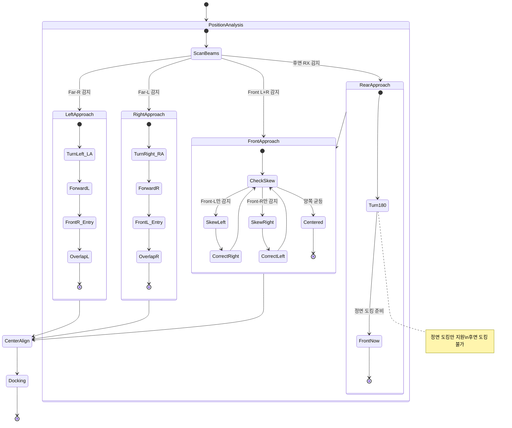
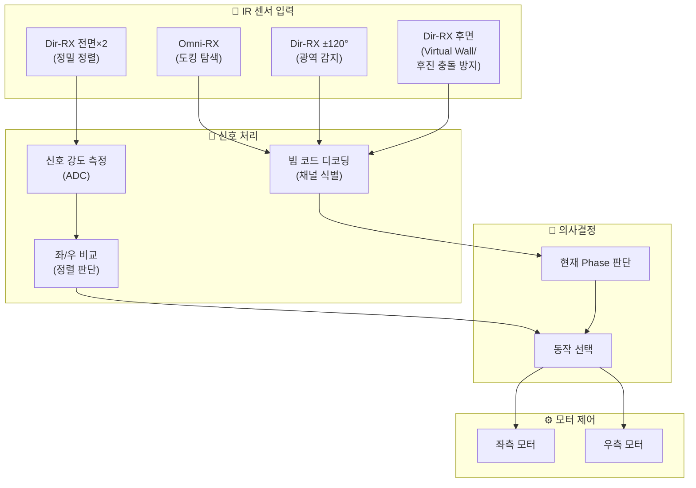
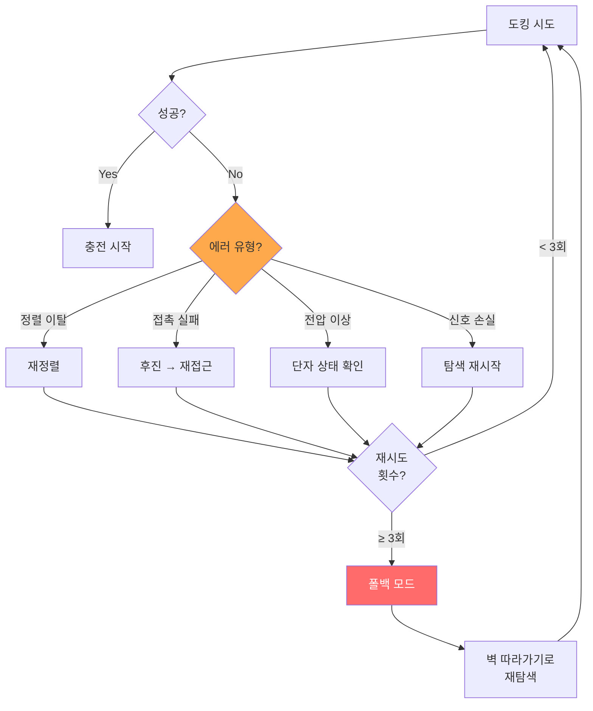
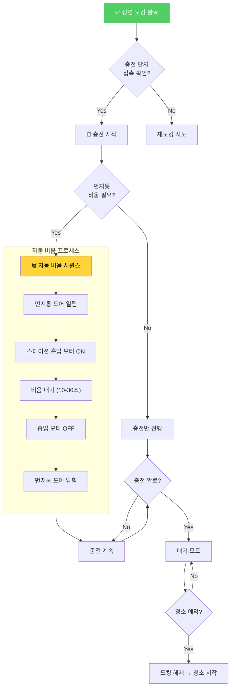

# 🎯 도킹 알고리즘 상세 순서도

> **도킹 방식**: 정면 도킹 (Front-First Docking)
> - 먼지통이 후면에 위치
> - 로봇 전면으로 스테이션에 진입하여 충전 단자 접촉
> - 자동 비움 스테이션의 경우, 도킹 후 후면 먼지통이 흡입구와 연결

## 1. 전체 도킹 프로세스



## 2. 위치별 접근 시나리오 상태도



## 3. 센서 신호 처리 흐름



## 4. 에러 처리 및 재시도



## 5. 도킹 완료 후 시퀀스 (자동 비움 스테이션)



### 도킹 구조 (정면 도킹 + 후면 먼지통)

```
        ┌─────────────────────────────┐
        │      Auto-Empty Station      │
        │  ┌─────────────────────┐    │
        │  │    흡입구 (상단)     │◀───┼── 로봇 후면 (먼지통) 연결
        │  └─────────────────────┘    │
        │                             │
        │    ┌───┐       ┌───┐       │
        │    │ L │       │ R │       │◀── 충전 단자
        │    └───┘       └───┘       │
        │         IR Beams            │
        └──────────┬──────────────────┘
                   │
                   ▼
            ┌─────────────┐
            │  🤖 Robot   │
            │ ┌─────────┐ │
            │ │ 전면    │ │◀── 충전 접점
            │ │ (Front) │ │
            │ └─────────┘ │
            │             │
            │ ┌─────────┐ │
            │ │ 먼지통  │ │◀── 후면 (흡입구와 연결)
            │ │ (Rear)  │ │
            │ └─────────┘ │
            └─────────────┘
```
