# 🚧 장애물 회피 알고리즘 상세 순서도

## 1. IR 센서 사양

### 송신부 (TX LED)

| Parameter | Value | Note |
|-----------|-------|------|
| 파장 | 940nm | 근적외선 |
| 구동 주파수 | 38kHz | PWM 변조 |
| 구동 전류 | 20~100mA | 거리에 따라 조절 |
| 빔 각도 | 20°~30° | SMD 타입 |
| 채널 수 | 20개 | 범퍼 전면 배치 |
| 스캔 방식 | 순차 멀티플렉싱 | ~50ms/전체 스캔 |

### 수신부 (IR Receiver)

| Parameter | Value | Note |
|-----------|-------|------|
| 호환 IC | TSOP38238 / VS1838B | - |
| 수신 파장 | 940nm ±50nm | IR LED와 매칭 |
| 중심 주파수 | 38kHz | 대역통과 필터 |
| AGC | 내장 | 자동 게인 제어 |
| 출력 | Active Low | 감지 시 LOW |
| 응답 시간 | ~300µs | - |

### 감지 범위

| Distance | Signal Strength | Reliability |
|----------|----------------|-------------|
| 0-2cm | Very Strong | 포화 가능 |
| 2-10cm | Strong | ★★★★★ |
| 10-25cm | Medium | ★★★★☆ |
| 25-40cm | Weak | ★★★☆☆ |
| >40cm | Very Weak | 불안정 |

---

## 2. 메인 장애물 감지 루프

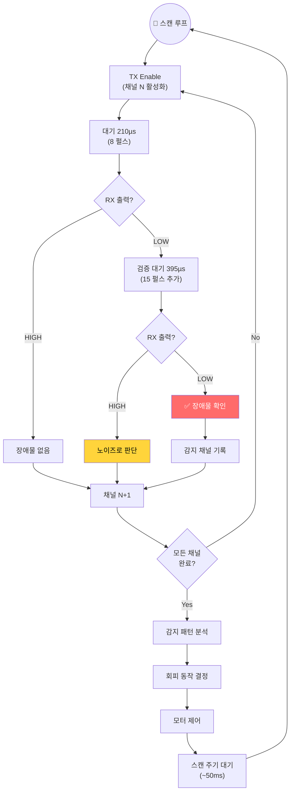

## 3. 채널별 장애물 위치 판단

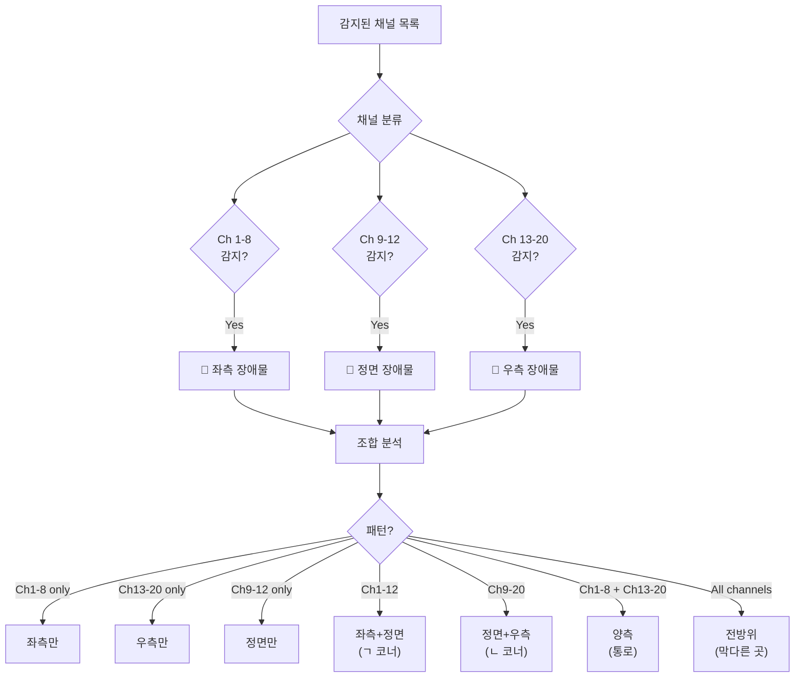

## 4. 시나리오별 회피 알고리즘

### Scenario 1: 정면 벽

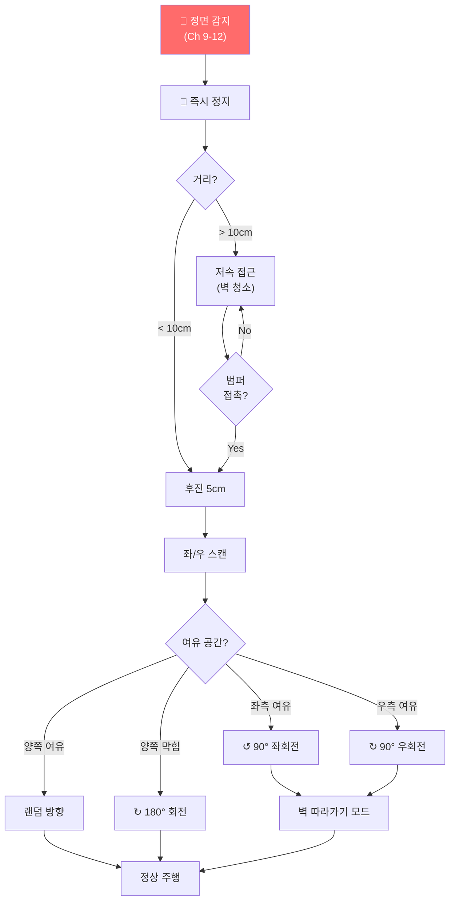

### Scenario 2: 좌측 장애물

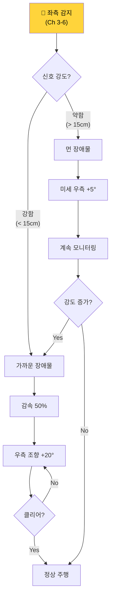

### Scenario 3: 우측 장애물

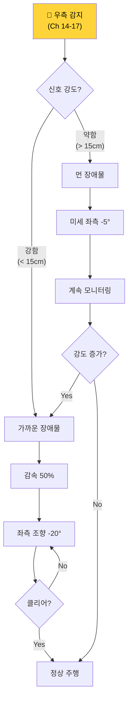

### Scenario 4: 코너 진입 (ㄱ자)

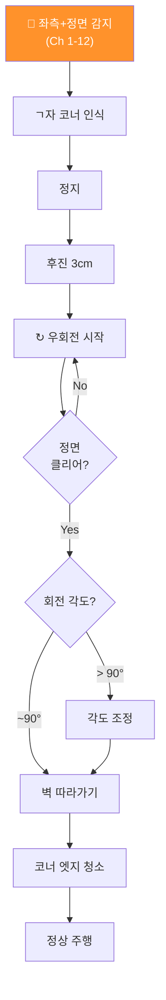

### Scenario 5: 코너 진입 (ㄴ자)

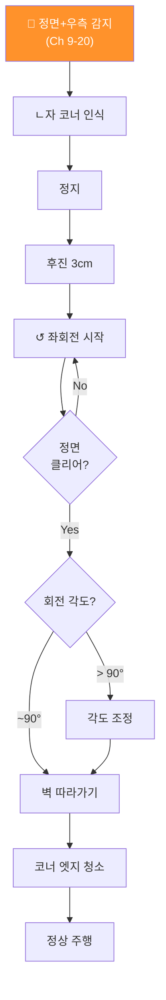

### Scenario 6: 좁은 통로 (양측 장애물)

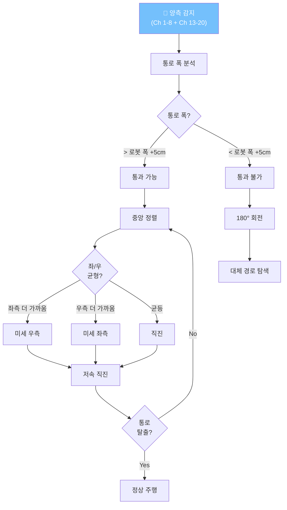

### Scenario 7: 막다른 곳 (전방위 장애물)

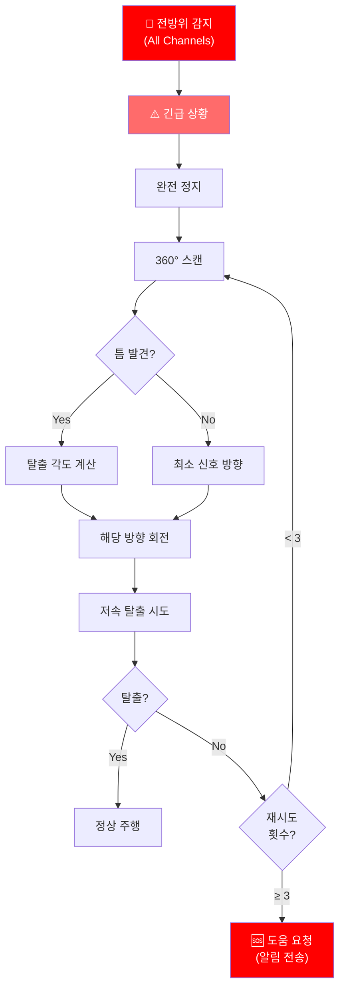

### Scenario 8: 낭떠러지 감지 (클리프 센서)

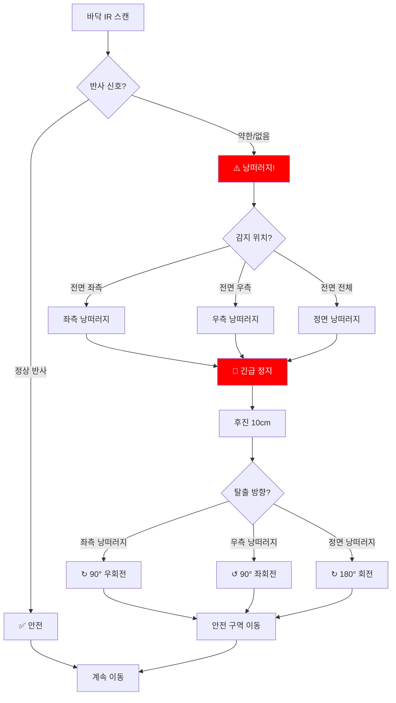

### Scenario 9: 동적 장애물 (사람/반려동물)

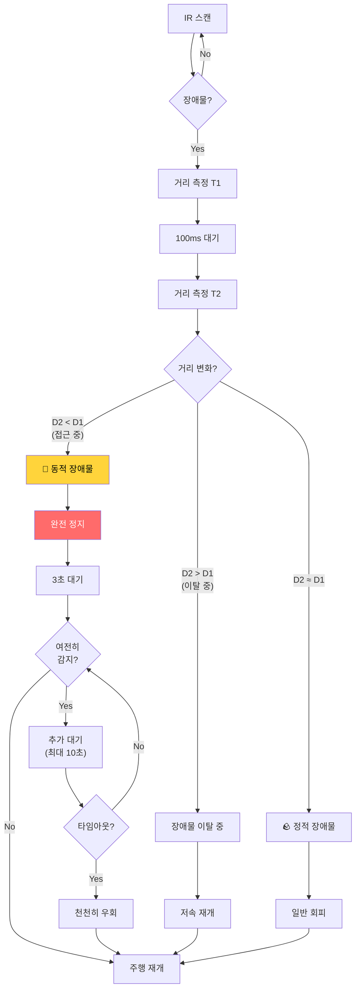

---

## 5. 센서 채널 맵핑 다이어그램

```
                      전면 (Front)
              ┌─────────────────────────┐
              │                         │
          ┌───┤  [9] [10] [11] [12]    ├───┐
          │   │                         │   │
          │ ┌─┤ [8]               [13] ├─┐ │
          │ │ │                         │ │ │
        좌│ │ │ [7]               [14] │ │ │우
        측│ │ │                         │ │ │측
          │ │ │ [6]               [15] │ │ │
          │ │ │                         │ │ │
          │ │ │ [5]               [16] │ │ │
          │ └─┤                         ├─┘ │
          │   │ [4]               [17] │   │
          └───┤                         ├───┘
              │ [3]               [18] │
              │                         │
              │ [2]               [19] │
              │                         │
              │ [1]               [20] │
              └─────────────────────────┘
                      후면 (Rear)


    채널 그룹:
    ━━━━━━━━━━━━━━━━━━━━━━━━━━━━━━━━━━━━━━━━
    Ch 1-4   : 좌측 후방  (Left Rear)
    Ch 5-8   : 좌측 전방  (Left Front)
    Ch 9-12  : 정면       (Center Front)
    Ch 13-16 : 우측 전방  (Right Front)
    Ch 17-20 : 우측 후방  (Right Rear)
```

## 6. 회피 우선순위

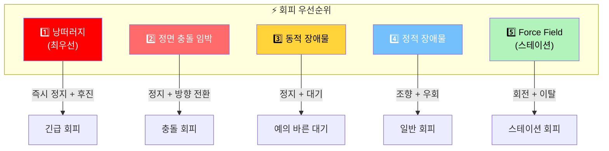
