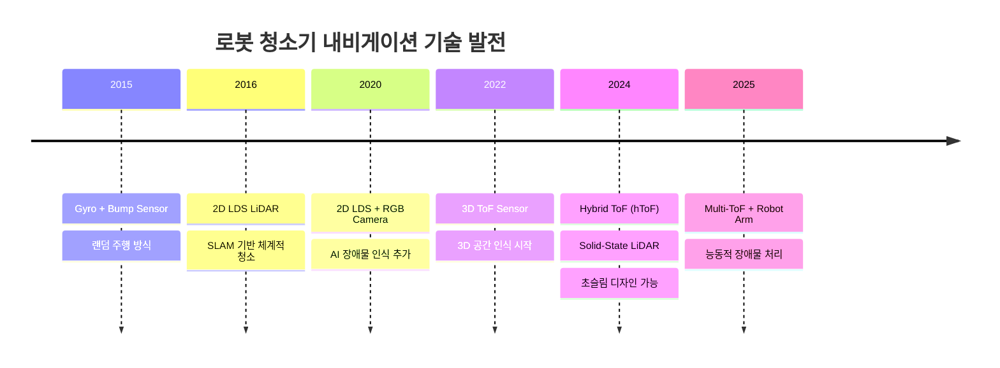
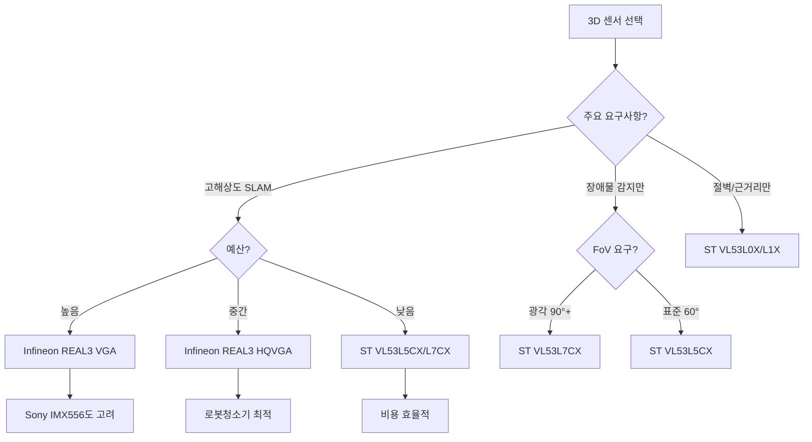

# 로봇 청소기 3D 내비게이션 솔루션 분석

차세대 로봇 청소기에 적용되는 3D ToF(Time-of-Flight) 및 Solid-State LiDAR 기술 분석 문서입니다.

## 📋 목차

- [개요](#개요)
- [기술 발전 동향](#기술-발전-동향)
- [3D ToF vs 2D LDS 비교](#3d-tof-vs-2d-lds-비교)
- [주요 센서 솔루션](#주요-센서-솔루션)
  - [Infineon REAL3](#infineon-real3)
  - [STMicroelectronics FlightSense](#stmicroelectronics-flightsense)
  - [Sony DepthSense](#sony-depthsense)
- [적용 사례](#적용-사례)
- [시스템 설계 가이드](#시스템-설계-가이드)
- [비용 분석](#비용-분석)
- [참고 자료](#참고-자료)

---

## 개요

2024년을 기점으로 프리미엄 로봇 청소기 시장은 기존 2D LDS(Laser Distance Sensor) LiDAR에서 **3D ToF(Time-of-Flight)** 기반 내비게이션으로 급격히 전환되고 있습니다.

### 왜 3D로 전환되는가?

| 기존 2D LDS의 한계 | 3D ToF의 해결 |
|-------------------|---------------|
| 높이 정보 부재 (수평면만 스캔) | 완전한 3D 공간 인식 |
| 회전 기구부로 인한 높이 제한 | Solid-State로 초슬림 설계 가능 |
| 작은 물체(케이블, 양말) 인식 불가 | 고해상도 장애물 분류 |
| 가구 아래 진입 판단 어려움 | 정확한 높이 측정 |
| 기계적 마모/고장 위험 | 무구동부로 신뢰성 향상 |

### 시장 트렌드 (2024-2025)

```
2016: Roborock, LDS LiDAR 양산 시작
2022: Dreame W10 Pro, Infineon REAL3 ToF 최초 탑재
2024: Roborock V20, Dual-Light Solid-State LiDAR (hToF) 출시
2025: Roborock Saros Z70, ToF 기반 5축 로봇팔 탑재
```

---

## 기술 발전 동향

### 세대별 내비게이션 기술



### Hybrid ToF (hToF) 기술

Roborock과 Infineon/pmd가 5년간 공동 개발한 차세대 기술입니다.

```
┌─────────────────────────────────────────────────────────────┐
│                   Hybrid ToF (hToF) 구조                     │
├─────────────────────────────────────────────────────────────┤
│                                                             │
│   ┌─────────────┐     ┌─────────────┐                      │
│   │  Spot Light │     │ Flood Light │                      │
│   │   Emitter   │     │   Emitter   │                      │
│   └──────┬──────┘     └──────┬──────┘                      │
│          │                   │                              │
│          └─────────┬─────────┘                              │
│                    ▼                                        │
│          ┌─────────────────┐                               │
│          │   ToF Imager    │                               │
│          │  (QVGA/VGA)     │                               │
│          │  21,600+ points │                               │
│          └────────┬────────┘                               │
│                   │                                         │
│                   ▼                                         │
│  ┌────────────────────────────────────────┐                │
│  │           3D Point Cloud               │                │
│  │  • Navigation (SLAM)                   │                │
│  │  • Obstacle Avoidance                  │                │
│  │  • Under-furniture Detection           │                │
│  └────────────────────────────────────────┘                │
│                                                             │
│  장점: LDS 대비 100배 소형화, 슬림 디자인 가능               │
└─────────────────────────────────────────────────────────────┘
```

---

## 3D ToF vs 2D LDS 비교

### 기술 사양 비교

| 항목 | 2D LDS LiDAR | 3D ToF (hToF) |
|------|-------------|---------------|
| **측정 방식** | 삼각 측량 (회전) | Time-of-Flight |
| **출력 데이터** | 2D 포인트 (360°) | 3D 포인트 클라우드 |
| **해상도** | ~2,000 points/scan | 21,600+ points (QVGA) |
| **FoV** | 360° (수평) | 60°×45° ~ 90°×90° |
| **측정 거리** | 8~25m | 0.1~10m |
| **프레임 레이트** | 5~15 Hz | 30~60 Hz |
| **높이** | 40~50mm (터렛 포함) | 10mm 이하 가능 |
| **신뢰성** | 기계적 마모 있음 | 무구동부 (Solid-State) |
| **가격** | $10~30 | $15~50 |
| **장애물 분류** | 불가 | AI 연동 가능 |

### 적용 시나리오 비교

| 시나리오 | 2D LDS | 3D ToF | 비고 |
|---------|--------|--------|------|
| 벽/가구 매핑 | ✅ 우수 | ✅ 우수 | 동등 |
| 바닥 케이블 회피 | ❌ 불가 | ✅ 우수 | 3D 필수 |
| 양말/슬리퍼 회피 | ❌ 불가 | ✅ 우수 | 3D 필수 |
| 가구 아래 진입 | △ 제한적 | ✅ 정확 | 높이 측정 |
| 어두운 환경 | ✅ 우수 | ✅ 우수 | IR 기반 |
| 강한 햇빛 | ✅ 우수 | △ SBI 필요 | ToF 약점 |
| 반사 표면 | ✅ 우수 | △ 멀티패스 이슈 | ToF 약점 |
| 초슬림 디자인 | ❌ 불가 | ✅ 가능 | hToF 장점 |

---

## 주요 센서 솔루션

### Infineon REAL3

Infineon과 pmdtechnologies가 공동 개발한 ToF 이미지 센서 제품군입니다.

#### 제품 라인업

| 모델 | 해상도 | 특징 | 가격대 |
|------|--------|------|--------|
| IRS2381C | HQVGA (224×172) | Consumer, 저가형 | $ |
| IRS2877C | HQVGA (224×172) | Automotive 대응 | $$ |
| IRS2976C | VGA (640×480) | 고해상도, 최신 | $$$ |

#### IRS2381C 주요 사양 (로봇 청소기용)

```
┌─────────────────────────────────────────────┐
│           Infineon IRS2381C                 │
├─────────────────────────────────────────────┤
│ 해상도:        224 × 172 pixels (38k)       │
│ 폼팩터:        4.42 × 5.02 mm² (Bare Die)   │
│ 측정 거리:     0.1m ~ 5m                    │
│ FoV:          최대 120° (렌즈 의존)         │
│ 프레임 레이트:  최대 60 fps                  │
│ 인터페이스:    MIPI CSI-2 / Parallel        │
│ 광원:         940nm VCSEL (외장)           │
│ 전원:         1.2V (Core) + 1.8V (I/O)     │
│ SBI:          내장 (강한 햇빛 대응)         │
└─────────────────────────────────────────────┘
```

#### 시스템 블록도

```
┌──────────────────────────────────────────────────────────────┐
│                  REAL3 ToF Camera System                     │
├──────────────────────────────────────────────────────────────┤
│                                                              │
│  ┌─────────────┐   ┌─────────────┐   ┌─────────────┐        │
│  │   VCSEL     │   │  REAL3 ToF  │   │   Lens      │        │
│  │  Driver IC  │   │   Imager    │   │  Assembly   │        │
│  │  (IRS9100C) │   │  (IRS2381C) │   │             │        │
│  └──────┬──────┘   └──────┬──────┘   └──────┬──────┘        │
│         │                 │                 │                │
│         │    940nm IR     │    Reflected    │                │
│         │  ─────────────► │ ◄───────────────│                │
│         │                 │                 │                │
│         └────────┬────────┴────────┬────────┘                │
│                  │                 │                          │
│                  ▼                 ▼                          │
│         ┌─────────────────────────────────────┐              │
│         │        Application Processor         │              │
│         │   (MIPI CSI-2 / Parallel Interface)  │              │
│         │                                      │              │
│         │   Raw Data → Depth Map + Amplitude   │              │
│         │            → Point Cloud             │              │
│         │            → SLAM / Obstacle Avoid   │              │
│         └─────────────────────────────────────┘              │
│                                                              │
└──────────────────────────────────────────────────────────────┘
```

#### 적용 제품

- Dreame Bot W10 Pro (2022)
- Roborock V20 (2024) - hToF
- Roborock Qrevo Slim (2024) - StarSight
- Roborock Saros Z70 (2025) - 5축 로봇팔 탑재

---

### STMicroelectronics FlightSense

STMicroelectronics의 ToF 센서 제품군으로, 단일 센서부터 멀티존 이미저까지 다양한 라인업을 제공합니다.

#### 제품 라인업

| 모델 | 타입 | 해상도 | FoV | 거리 | 용도 |
|------|------|--------|-----|------|------|
| VL53L0X | Single-zone | 1×1 | - | 2m | 절벽 감지 |
| VL53L1X | Single-zone | 1×1 | 27° | 4m | 근거리 측정 |
| VL53L5CX | Multi-zone | 8×8 (64) | 63° | 4m | 장애물 감지 |
| VL53L7CX | Multi-zone | 8×8 (64) | 90° | 3.5m | 광각 SLAM |
| VL53L8CH | Multi-zone | 8×8 (64) | 65° | 4m | 고정밀 |

#### VL53L5CX/L7CX 사양 비교

```
┌────────────────────────────────────────────────────────────┐
│              STMicroelectronics Multi-zone ToF             │
├────────────────────────┬───────────────────────────────────┤
│        항목            │   VL53L5CX    │    VL53L7CX      │
├────────────────────────┼───────────────┼──────────────────┤
│ 해상도                 │   8×8 (64존)  │    8×8 (64존)    │
│ FoV (대각선)           │     63°       │       90°        │
│ 측정 거리              │    ~4m        │      ~3.5m       │
│ 프레임 레이트          │   최대 60Hz   │    최대 60Hz     │
│ 인터페이스             │  I2C (1MHz)   │   I2C (1MHz)     │
│ 패키지                 │ 6.4×3.0mm LGA │  6.4×3.0mm LGA   │
│ 전원                   │  2.8V + 1.8V  │   2.8V + 1.8V    │
│ 광원                   │ 940nm VCSEL   │  940nm VCSEL     │
│ Multi-object 감지      │      ✅       │       ✅         │
│ Glass 크로스토크 보정  │    60cm+      │     60cm+        │
└────────────────────────┴───────────────┴──────────────────┘
```

#### 회로 연결 (VL53L5CX)

```
                    VL53L5CX
                 ┌─────────────┐
                 │             │
     3.3V ───────┤ AVDD   SDA ├──────────── MCU I2C SDA
                 │             │               │
     1.8V ───────┤ IOVDD  SCL ├───────────────┼── MCU I2C SCL
                 │             │               │
      GND ───────┤ GND    INT ├───────────────┼── MCU GPIO (IRQ)
                 │             │               │
      GND ───────┤ THERMAL    │          [Pull-up 4.7kΩ]
                 │             │
 MCU GPIO ───────┤ LPn   PWREN├─────── Enable (Optional)
                 │             │
 MCU GPIO ───────┤ I2C_RST    │
                 │             │
                 └─────────────┘

※ 펌웨어 로딩 필요 (~90KB, I2C로 전송)
※ Flash 용량 충분한 MCU 필요 (ESP32, STM32F4 이상 권장)
```

#### 적용 예시

```c
// VL53L5CX 초기화 예시 (ULD API)
#include "vl53l5cx_api.h"

VL53L5CX_Configuration dev;
VL53L5CX_ResultsData results;

// 디바이스 초기화
status = vl53l5cx_init(&dev);

// 해상도 설정 (4x4 or 8x8)
status = vl53l5cx_set_resolution(&dev, VL53L5CX_RESOLUTION_8X8);

// 레인징 주파수 설정
status = vl53l5cx_set_ranging_frequency_hz(&dev, 15);

// 측정 시작
status = vl53l5cx_start_ranging(&dev);

// 데이터 읽기
while(1) {
    status = vl53l5cx_check_data_ready(&dev, &ready);
    if(ready) {
        vl53l5cx_get_ranging_data(&dev, &results);
        
        // 64개 존의 거리 데이터 처리
        for(int i = 0; i < 64; i++) {
            uint16_t distance_mm = results.distance_mm[i];
            uint8_t status = results.target_status[i];
            // SLAM / 장애물 회피 처리
        }
    }
}
```

---

### Sony DepthSense

Sony의 산업용/소비자용 ToF 이미지 센서 제품군입니다.

#### 제품 라인업

| 모델 | 타입 | 해상도 | 거리 | 특징 |
|------|------|--------|------|------|
| IMX556PLR | iToF | VGA (640×480) | ~6m | BSI, 고정밀 |
| IMX570PLR | iToF | VGA (640×480) | ~5m | 저전력 |
| IMX560 | dToF (SPAD) | 저해상도 | ~15m | 장거리 |

#### IMX556PLR 사양

```
┌─────────────────────────────────────────────┐
│           Sony IMX556PLR DepthSense         │
├─────────────────────────────────────────────┤
│ 해상도:        640 × 480 pixels (VGA)       │
│ 픽셀 크기:     10μm × 10μm                  │
│ 센서 크기:     1/2"                         │
│ 측정 거리:     0.3m ~ 6m                    │
│ 프레임 레이트:  최대 60 fps                  │
│ 정확도:        <5mm (0.3~1.5m)              │
│ 정밀도:        <2mm @ 1m                    │
│ 인터페이스:    MIPI CSI-2                   │
│ 광원:         850nm/940nm VCSEL (외장)      │
│ 구조:         Back-Illuminated (BSI)        │
│ 동작 온도:    -10°C ~ +60°C                 │
└─────────────────────────────────────────────┘
```

#### CAPD 기술

Sony의 핵심 차별화 기술인 CAPD(Current Assisted Photonic Demodulator):

```
일반 ToF 픽셀                    Sony CAPD 픽셀
┌──────────────┐                ┌──────────────┐
│   Photodiode │                │   Photodiode │
│      ┌─┐     │                │   ┌──────┐   │
│      │ │     │                │   │Drift │   │
│      │ │     │                │   │Field │   │
│      └─┘     │                │   └──┬───┘   │
│    느린 전하 │                │  빠른 전하    │
│    확산 방식 │                │  드리프트 방식│
└──────────────┘                └──────────────┘
     저속/저정밀                      고속/고정밀
```

---

## 적용 사례

### Roborock StarSight Autonomous System

Roborock이 Infineon/pmd/O-film과 5년간 공동 개발한 시스템입니다.

```
┌─────────────────────────────────────────────────────────────┐
│              StarSight Autonomous System 2.0                │
├─────────────────────────────────────────────────────────────┤
│                                                             │
│  ┌─────────────────────────────────────────────────────┐   │
│  │              Dual-Light Solid-State LiDAR            │   │
│  │  ┌─────────┐  ┌─────────┐  ┌──────────────────┐    │   │
│  │  │ Spot    │  │ Flood   │  │ QVGA ToF Imager  │    │   │
│  │  │ VCSEL   │  │ VCSEL   │  │ 21,600 points    │    │   │
│  │  └────┬────┘  └────┬────┘  └────────┬─────────┘    │   │
│  │       │            │                │               │   │
│  │       └────────────┴────────────────┘               │   │
│  │              3D Navigation + Mapping                │   │
│  └─────────────────────────────────────────────────────┘   │
│                            │                                │
│  ┌─────────────────────────┼─────────────────────────────┐ │
│  │                         ▼                             │ │
│  │  ┌─────────────┐  ┌─────────────┐  ┌─────────────┐   │ │
│  │  │ RGB Camera  │  │ IR Sensors  │  │ VertiBeam   │   │ │
│  │  │ (AI 분류)   │  │ (측면 감지) │  │ (측면 측정) │   │ │
│  │  └─────────────┘  └─────────────┘  └─────────────┘   │ │
│  │              Obstacle Avoidance Layer                 │ │
│  └───────────────────────────────────────────────────────┘ │
│                                                             │
│  적용 모델: Qrevo Slim, Saros 10R, Saros Z70               │
│  특징: LDS 대비 100배 소형화, 3.14" 높이 실현              │
│       샘플링 주파수 21배 향상, 가구 아래 정밀 인식         │
└─────────────────────────────────────────────────────────────┘
```

### Dreame Bot W10 Pro (Infineon REAL3)

```
┌─────────────────────────────────────────────────────────────┐
│                 Dreame W10 Pro ToF System                   │
├─────────────────────────────────────────────────────────────┤
│                                                             │
│   전면 ToF 카메라 (REAL3 IRS2381C 기반)                     │
│   ┌─────────────────────────────────────┐                   │
│   │  • 38,000 pixels (HQVGA)            │                   │
│   │  • 장애물 3D 감지                   │                   │
│   │  • 케이블/양말/슬리퍼 회피          │                   │
│   │  • SBI로 다양한 조명 대응           │                   │
│   └─────────────────────────────────────┘                   │
│                        +                                    │
│   상단 LDS LiDAR (기존 방식)                                │
│   ┌─────────────────────────────────────┐                   │
│   │  • 360° 2D SLAM                     │                   │
│   │  • 벽/가구 매핑                     │                   │
│   └─────────────────────────────────────┘                   │
│                                                             │
│   = Hybrid Navigation (2D SLAM + 3D Obstacle Avoidance)     │
└─────────────────────────────────────────────────────────────┘
```

---

## 시스템 설계 가이드

### 센서 선택 기준



### 멀티 센서 구성 예시

#### 구성 1: Full 3D Navigation (프리미엄)

```
┌─────────────────────────────────────────────────────────────┐
│                  Premium 3D Navigation                       │
├─────────────────────────────────────────────────────────────┤
│                                                             │
│  전면: Infineon REAL3 HQVGA × 2 (전방/하방)                 │
│        └─ 장애물 감지, 가구 아래 측정                       │
│                                                             │
│  측면: ST VL53L5CX × 2 (좌/우)                              │
│        └─ 벽면 추종, 측면 장애물                            │
│                                                             │
│  하단: ST VL53L0X × 4~6 (절벽 감지 어레이)                  │
│        └─ 계단/낙하 방지                                    │
│                                                             │
│  예상 BOM: $50~80                                           │
└─────────────────────────────────────────────────────────────┘
```

#### 구성 2: Hybrid Navigation (중급)

```
┌─────────────────────────────────────────────────────────────┐
│                  Hybrid Navigation                           │
├─────────────────────────────────────────────────────────────┤
│                                                             │
│  상단: 2D LDS LiDAR (SLAM용)                                │
│        └─ 벽/가구 매핑, 360° 스캔                           │
│                                                             │
│  전면: ST VL53L7CX (90° FoV)                                │
│        └─ 전방 장애물 감지                                  │
│                                                             │
│  하단: ST VL53L0X × 4 (절벽 감지)                           │
│        └─ 계단/낙하 방지                                    │
│                                                             │
│  예상 BOM: $25~40                                           │
└─────────────────────────────────────────────────────────────┘
```

#### 구성 3: Cost-Optimized (보급형)

```
┌─────────────────────────────────────────────────────────────┐
│                  Cost-Optimized                              │
├─────────────────────────────────────────────────────────────┤
│                                                             │
│  전면: ST VL53L5CX × 1 (8×8 Multi-zone)                     │
│        └─ 전방 장애물 + 간이 SLAM                           │
│                                                             │
│  측면: IR 센서 (벽면 추종)                                  │
│        └─ 저가형 아날로그 센서                              │
│                                                             │
│  하단: ST VL53L0X × 2 (절벽 감지)                           │
│        └─ 최소 구성                                         │
│                                                             │
│  예상 BOM: $10~20                                           │
└─────────────────────────────────────────────────────────────┘
```

### 프로세서 요구사항

| 센서 구성 | 최소 프로세서 | 권장 프로세서 | RAM |
|----------|--------------|--------------|-----|
| VL53L5CX 단일 | Cortex-M4 | STM32F4 | 64KB+ |
| REAL3 HQVGA | Cortex-A53 | RK3308/Allwinner | 512MB+ |
| REAL3 VGA | Cortex-A72 | RK3588/Jetson Nano | 2GB+ |
| Multi-ToF + AI | NPU 탑재 | Jetson Orin | 4GB+ |

---

## 비용 분석

### 센서별 예상 비용 (대량 구매 기준)

| 센서 | 단가 (1K) | 단가 (10K) | 단가 (100K) |
|------|----------|-----------|------------|
| VL53L0X | $2.5 | $2.0 | $1.5 |
| VL53L5CX | $8 | $6 | $4 |
| VL53L7CX | $10 | $8 | $6 |
| REAL3 HQVGA | $15 | $12 | $8 |
| REAL3 VGA | $25 | $20 | $15 |
| Sony IMX556 모듈 | $80 | $60 | $40 |

### 시스템 총 비용 비교

| 구성 | 센서 비용 | 광학/기구 | 프로세서 | 총 비용 |
|------|----------|----------|---------|--------|
| 2D LDS (기존) | $15 | $5 | $10 | ~$30 |
| 2D LDS + VL53L5CX | $20 | $8 | $15 | ~$43 |
| Full hToF (REAL3) | $25 | $15 | $30 | ~$70 |
| Premium (Sony) | $50 | $20 | $50 | ~$120 |

---

## 참고 자료

### 데이터시트 및 기술 문서

#### Infineon REAL3
- [REAL3 제품 페이지](https://www.infineon.com/products/sensor/tof-3d-image-sensors)
- [ToF Consumer 솔루션](https://www.infineon.com/products/sensor/tof-3d-image-sensors/consumer)
- [pmdtechnologies](https://pmdtec.com)
- [Roborock hToF 백서](https://www.infineon.com) - "Enabling the next generation of smarter self-navigating robots using Hybrid ToF"

#### STMicroelectronics FlightSense
- [VL53L5CX 제품 페이지](https://www.st.com/en/imaging-and-photonics-solutions/vl53l5cx.html)
- [VL53L7CX 제품 페이지](https://www.st.com/en/imaging-and-photonics-solutions/vl53l7cx.html)
- [ULD API 사용 가이드 (UM2884)](https://www.st.com/resource/en/user_manual/um2884-a-guide-to-using-the-vl53l5cx-multizone-timeofflight-ranging-sensor-with-wide-field-of-view-ultra-lite-driver-uld-stmicroelectronics.pdf)

#### Sony DepthSense
- [ToF 이미지 센서](https://www.sony-semicon.com/en/products/is/industry/tof.html)
- [IMX556 제품 개요](https://www.sony-semicon.com/en/products/is/industry/tof/itof.html)
- [FRAMOS Sony ToF](https://framos.com/products-solutions/image-sensors/time-of-flight/)

### 개발 키트 및 평가 보드

| 제조사 | 제품 | 센서 | 가격대 |
|--------|------|------|--------|
| Infineon/pmd | flexx2 | REAL3 | $300~500 |
| STMicroelectronics | X-NUCLEO-53L5A1 | VL53L5CX | $50 |
| SparkFun | Qwiic ToF Imager | VL53L5CX | $30 |
| LUCID | Helios2 | IMX556 | $800~1200 |
| Seeed Studio | DepthEye | IMX556 | $200~300 |

### 소프트웨어 및 SDK

- **Infineon**: Royale SDK (pmd)
- **STMicroelectronics**: VL53L5CX ULD API (C)
- **Sony**: Custom SDK (파트너 통해 제공)
- **오픈소스**: 
  - [ROS2 ToF 드라이버](https://github.com/ros-perception/)
  - [Open3D (Point Cloud 처리)](https://github.com/isl-org/Open3D)

---

## 라이선스

이 문서는 [MIT License](LICENSE)에 따라 배포됩니다.

---

## 기여

이슈 리포트나 Pull Request는 언제나 환영합니다!
