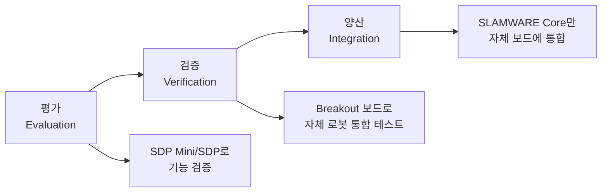
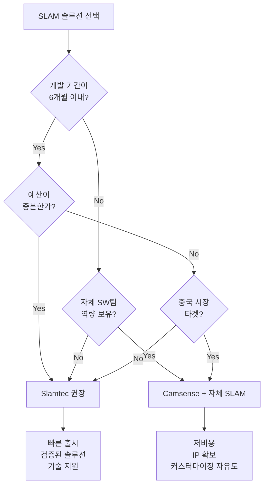

# 로봇 청소기 SLAM 솔루션 비교: Slamtec vs Camsense

로봇 청소기 개발 시 외부 SLAM 알고리즘 솔루션 선택을 위한 기술 분석 문서입니다.

## 📋 목차

- [개요](#개요)
- [Slamtec 솔루션](#slamtec-솔루션)
- [Camsense 솔루션](#camsense-솔루션)
- [비교 요약](#비교-요약)
- [설계 권장 사항](#설계-권장-사항)
- [참고 자료](#참고-자료)

---

## 개요

로봇 청소기의 자율 주행을 위한 SLAM(Simultaneous Localization and Mapping) 알고리즘 구현 방식은 크게 세 가지로 나뉩니다:

| 옵션 | 비용 | 개발기간 | 비고 |
|------|------|----------|------|
| 자체개발 | 인건비만 | 12개월+ | 핵심 IP 확보 |
| Slamtec | $3~5/unit | 즉시 | 로열티 방식 |
| Camsense | $2~4/unit | 2개월 | 중국향 유리 |

본 문서에서는 외부 솔루션인 **Slamtec**과 **Camsense**의 제공 범위, 회로 요구사항, 설계 내용을 상세히 비교합니다.

---

## Slamtec 솔루션

Slamtec은 **턴키(Turnkey) 방식**으로 SLAM 솔루션을 제공합니다. 단순히 LiDAR 센서만 제공하는 것이 아니라 **메인 프로세서 모듈(SLAMWARE Core)과 개발 보드(Breakout Board)까지 함께 제공**합니다.

### 제공 구성품

| 제품 | 설명 | 용도 |
|------|------|------|
| **RPLIDAR** (A1/A2/A3/S2/S3) | 360° 2D LiDAR 센서 | 거리 측정 |
| **SLAMWARE Core** | Mini PCI-E 폼팩터의 SLAM 처리 모듈 | 내장 SLAM 알고리즘 |
| **SLAMWARE Breakout** | STM32F103VET6 기반 개발 보드 | 센서/모터 연결 |
| **SDP Mini/SDP** | 완제품 평가 플랫폼 | 빠른 검증용 |

### 시스템 아키텍처

```
┌─────────────────────────────────────────────────────────────┐
│                     Application Layer                        │
│              (Windows/Linux/Android/iOS SDK)                 │
└──────────────────────┬──────────────────────────────────────┘
                       │ Ethernet 100Mbps / WiFi
┌──────────────────────▼──────────────────────────────────────┐
│                   SLAMWARE Core Module                       │
│  ┌─────────────────────────────────────────────────────┐    │
│  │  내장: SLAM 알고리즘, D* 경로 계획, 장애물 회피       │    │
│  │  인터페이스: Mini PCI-E, Ethernet, WiFi              │    │
│  │  전원: 5V                                            │    │
│  └─────────────────────────────────────────────────────┘    │
└────────┬─────────────────────────────────┬──────────────────┘
         │ Control Bus                     │ LIDAR Bus
         │ (UART 115200)                   │ (UART 115200)
┌────────▼───────────────────┐    ┌───────▼───────────────────┐
│   Base Control MCU          │    │       RPLIDAR             │
│   (STM32F103VET6 예시)       │    │  (A1/A2/A3/S2/S3 선택)    │
│   - 모터 드라이버 제어        │    │  - 360° 스캔              │
│   - 센서 데이터 수집         │    │  - 5~8m 측정 거리          │
│   - 오도메트리              │    │  - 5cm 해상도              │
└────────┬───────────────────┘    └───────────────────────────┘
         │
    ┌────┴────┬─────────┬─────────┬─────────┐
    ▼         ▼         ▼         ▼         ▼
 휠모터   범퍼센서   클리프센서  초음파   충전도킹
```

### SLAMWARE Breakout 보드 인터페이스

| 인터페이스 | 사양 | 용도 |
|-----------|------|------|
| Control Bus | UART 115200bps | Core ↔ Base MCU 통신 |
| LIDAR Bus | UART 115200bps | Core ↔ RPLIDAR 직접 연결 |
| High Speed Bus | Ethernet 100Mbps | Core ↔ Application 통신 |
| Motor Control | PWM 출력 | DC/BLDC 모터 구동 |
| Sensor I/O | GPIO, ADC | 범퍼, 클리프, 초음파 등 |
| 전원 | 5V 입력 | 시스템 전원 |

### 개발 프로세스



### RPLIDAR 모델별 사양

| 모델 | 측정 거리 | 샘플링 레이트 | 스캔 주파수 | 가격대 |
|------|----------|--------------|------------|--------|
| A1 | 12m | 8,000 Hz | 5.5 Hz | $ |
| A2 | 18m | 8,000 Hz | 10 Hz | $$ |
| A3 | 25m | 16,000 Hz | 15 Hz | $$$ |
| S2 | 30m | 32,000 Hz | 10 Hz | $$$$ |
| S3 | 40m | 32,000 Hz | 15 Hz | $$$$$ |

### SDK 지원 플랫폼

- **Windows**: Visual Studio 2010 SP1, 32/64bit
- **Linux**: armv7hf, i386, x86_64 (gcc 4.6/4.8)
- **Android**: Java SDK
- **iOS**: Objective-C SDK
- **ROS/ROS2**: 공식 지원

---

## Camsense 솔루션

Camsense는 Slamtec과 다르게 **LiDAR 센서만 제공**하며, SLAM 알고리즘은 별도로 구현해야 합니다.

### Camsense X1 사양

| 항목 | 사양 |
|------|------|
| 인터페이스 | **3핀: 5V, GND, TX** |
| 통신 | UART 115200bps, 3.3V 레벨 |
| 측정 거리 | 약 8m |
| 회전 주기 | ~191ms/회전 (~5.2Hz) |
| 데이터 패킷 | 36바이트 (8스텝 거리/강도 데이터) |
| 가격 | $6~20 (매우 저렴) |

### 하드웨어 연결

```
┌─────────────────────┐
│    Camsense X1      │
│  ┌───┬───┬───┐     │
│  │5V │GND│TX │     │
│  └─┬─┴─┬─┴─┬─┘     │
└────┼───┼───┼───────┘
     │   │   │
     │   │   └──────────► MCU UART RX (3.3V 레벨)
     │   └──────────────► GND
     └──────────────────► 5V 전원

※ TX만 있음 (단방향, 명령 수신 불가)
※ 모터 제어 핀 없음 (내장 모터 자동 회전)
```

### 데이터 프로토콜

```
패킷 구조 (36 bytes):
┌────────┬────────┬─────────────────────────┬──────┐
│ Header │ Angle  │ Distance/Intensity x 8  │ CRC  │
│ (2B)   │ (2B)   │ (4B x 8 = 32B)          │ (2B) │
└────────┴────────┴─────────────────────────┴──────┘

- 회전당 약 50패킷 출력
- 각 패킷에 8개 측정점 포함
- 각도 해상도: 회전 속도에 따라 가변 (0.5° ~ 1.5°)
```

### 필요 추가 구현 사항

| 구현 항목 | 설명 | 오픈소스 옵션 |
|----------|------|--------------|
| **SLAM 알고리즘** | 지도 생성 및 위치 추정 | Cartographer, GMapping, BreezySLAM |
| **경로 계획** | 최적 경로 탐색 | A*, D*, RRT |
| **장애물 회피** | 동적 장애물 대응 | DWA, TEB |
| **위치 추정** | 센서 퓨전 | EKF, UKF |
| **프로세서** | 연산 처리 | ESP32, STM32, Raspberry Pi |

### 지원 드라이버 (커뮤니티)

- **ROS1**: [camsense_driver](https://github.com/Vidicon/camsense_driver)
- **ROS2**: [ros2_camsense_x1](https://github.com/rossihwang/ros2_camsense_x1)
- **STM32**: [Camsense_X1](https://github.com/anhui1995/Camsense_X1)
- **Arduino/ESP32**: [LDS Library](https://github.com/kaiaai/LDS)
- **Python**: [camsense_X1_lidar](https://github.com/IljaRukin/camsense_X1_lidar)

---

## 비교 요약

| 항목 | Slamtec | Camsense |
|------|---------|----------|
| **제공 범위** | LiDAR + SLAM Core + Dev Board | LiDAR만 |
| **SLAM 알고리즘** | 내장 (D* 경로계획 포함) | 별도 구현 필요 |
| **인터페이스** | UART + Ethernet + WiFi | UART (TX만) |
| **개발 복잡도** | 낮음 (SDK 제공) | 높음 (오픈소스 활용) |
| **비용** | $3~5/unit + Core 모듈 비용 | $2~4/unit (LiDAR만) |
| **적합 대상** | 빠른 개발, 양산 검증 완료 | 저비용, 자체 SW 역량 보유 |
| **SDK 지원** | Windows/Linux/Android/iOS | ROS 커뮤니티 드라이버 |
| **기술 지원** | 공식 문서 + FAE 지원 | 커뮤니티 기반 |

### 선택 가이드



---

## 설계 권장 사항

### Slamtec 선택 시

**하드웨어 요구사항:**
- SLAMWARE Core 모듈 장착용 Mini PCI-E 커넥터
- Ethernet PHY (100Mbps) 또는 WiFi 모듈
- Base MCU: STM32F103 급 이상
- RPLIDAR 전용 커넥터 (XH2.54-5P 또는 PH2.54-7P)

**소프트웨어 구현:**
```c
// Control Bus 프로토콜 예시 (Base MCU → SLAMWARE Core)
typedef struct {
    uint8_t header[2];      // 0x55, 0xAA
    uint8_t cmd;            // 명령 코드
    uint8_t payload_len;    // 페이로드 길이
    uint8_t payload[];      // 가변 데이터
    uint8_t checksum;       // XOR 체크섬
} slamware_packet_t;

// 오도메트리 데이터 전송
void send_odometry(int32_t left_tick, int32_t right_tick) {
    slamware_packet_t pkt;
    pkt.cmd = CMD_ODOMETRY;
    // ... 구현
}
```

**개발 단계:**
1. SDP Mini로 기능 평가 (2주)
2. Breakout 보드로 자체 하드웨어 통합 (4주)
3. SDK 기반 애플리케이션 개발 (4주)
4. SLAMWARE Core 직접 통합 및 양산 (4주)

### Camsense 선택 시

**권장 플랫폼:**
- **고성능**: Raspberry Pi 4 + ROS2 + Cartographer
- **저비용**: ESP32 + BreezySLAM
- **중간**: STM32F4 + 자체 SLAM 구현

**기본 연결 회로:**
```
ESP32                    Camsense X1
┌─────────┐             ┌─────────┐
│         │             │         │
│    3.3V ├─────────────┤ (내부)  │
│         │             │         │
│     GND ├─────────────┤ GND     │
│         │             │         │
│    5V   ├─────────────┤ 5V      │
│         │             │         │
│ GPIO16  ├─────────────┤ TX      │
│  (RX)   │             │         │
└─────────┘             └─────────┘
```

**소프트웨어 구현:**
```python
# Python 기본 드라이버 예시
import serial

class CamsenseX1:
    PACKET_SIZE = 36
    HEADER = bytes([0x55, 0xAA, 0x03, 0x08])
    
    def __init__(self, port='/dev/ttyUSB0', baudrate=115200):
        self.serial = serial.Serial(port, baudrate)
    
    def read_scan(self):
        # 헤더 동기화
        while True:
            data = self.serial.read(self.PACKET_SIZE)
            if data[:4] == self.HEADER:
                return self.parse_packet(data)
    
    def parse_packet(self, data):
        # 각도 및 거리 데이터 파싱
        start_angle = (data[4] | (data[5] << 8)) / 64.0
        points = []
        for i in range(8):
            offset = 6 + i * 4
            distance = data[offset] | (data[offset + 1] << 8)
            intensity = data[offset + 2]
            points.append((distance, intensity))
        return start_angle, points
```

**개발 일정 (예상):**
1. LiDAR 드라이버 구현 (1주)
2. SLAM 알고리즘 포팅/개발 (8~12주)
3. 경로 계획 구현 (4주)
4. 시스템 통합 및 튜닝 (4주)

---

## 참고 자료

### Slamtec
- [공식 홈페이지](https://www.slamtec.com)
- [기술 문서 (Wiki)](https://wiki.slamtec.com)
- [RPLIDAR SDK (GitHub)](https://github.com/Slamtec/rplidar_sdk)
- [ROS 드라이버](https://github.com/slamtec/rplidar_ros)

### Camsense
- [역공학 프로젝트 (GitHub)](https://github.com/Vidicon/camsense-X1)
- [ROS2 드라이버](https://github.com/rossihwang/ros2_camsense_x1)
- [Arduino LDS 라이브러리](https://github.com/kaiaai/LDS)
- [Awesome 2D LiDARs](https://github.com/kaiaai/awesome-2d-lidars)

### SLAM 오픈소스
- [Google Cartographer](https://github.com/cartographer-project/cartographer)
- [GMapping](https://github.com/ros-perception/slam_gmapping)
- [BreezySLAM](https://github.com/simondlevy/BreezySLAM)
- [OpenVSLAM](https://github.com/xdspacelab/openvslam)

---

## 라이선스

이 문서는 [MIT License](LICENSE)에 따라 배포됩니다.

---

## 기여

이슈 리포트나 Pull Request는 언제나 환영합니다!

1. Fork the Project
2. Create your Feature Branch (`git checkout -b feature/AmazingFeature`)
3. Commit your Changes (`git commit -m 'Add some AmazingFeature'`)
4. Push to the Branch (`git push origin feature/AmazingFeature`)
5. Open a Pull Request
